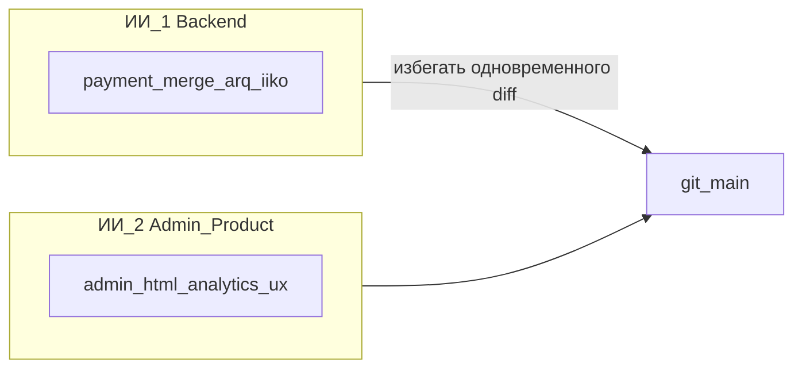

# RestoMind — план реализации до 100%

Документ описывает **всё**, что зафиксировано как «открыто / запланировано / частично» в [plan.md](plan.md) и [CHANGELOG.md](CHANGELOG.md), и не закрыто в текущем коде. Для каждой задачи: цель, затрагиваемые файлы, схема БД (если нужна миграция Alembic), эндпоинты, тесты, **Definition of Done** (что должно быть, чтобы считать задачу полностью сделанной).

Документ — рабочий: при выполнении пункт переносится в [CHANGELOG.md](CHANGELOG.md), а строка тут зачёркивается или удаляется.

Принципы (из [plan.md](plan.md) §«Правила разработки»):

- async-first, тонкие роутеры, тяжёлая логика — в `app/services/`.
- Источник правды по составу заказа и оплате — БД (`orders`, `payment_events`); Redis — кэш / сессия.
- Идемпотентность всего входящего трафика (WhatsApp `message_id`, `provider:payment_id`).
- Версионирование DRAFT через `orders.version` (`Order.row_version`).

---

## Статус по эпикам (актуализация коду)

| Эпик | Статус | Комментарий |
|------|--------|-------------|
| **E1** | Частично / ядро + аудит UI | Таблица `payment_webhook_events`, адаптеры, маршруты webhook, тесты; Super Admin — список/карточка аудита, **`GET /api/superadmin/payment-webhook-events/{id}/payload.bin`** (octet-stream) + ссылка скачивания в [`superadmin.html`](app/templates/superadmin.html). В модели нет глобального `UNIQUE (provider_slug, external_payment_id)` — идемпотентность в `apply_payment_webhook`; аудит — построчно на HTTP-запрос. |
| **E17** | Закрыт в текущем объёме | `POST /api/admin/failed-tasks/{id}/retry`, вкладка «Помощь клиентам»; отдельный пункт меню **«Ошибки»** — тот же экран и API, иная точка входа в навигации. |
| **E18** | Закрыт в текущем объёме | Индикатор готовности в шапке, `loadSetupStatus`, модалка чек-листа, тост при 100% (`sessionStorage`). |
| **E-UI / Phase U4.5** | Закрыт в текущем объёме (Workflow Loop) | Операционные вертикали админки: triage чатов, post-iiko fulfillment, upsell feedback из заказа, perf канбана/графиков, упаковка по scope — см. [docs/UI_REDESIGN_PLAN.md](docs/UI_REDESIGN_PLAN.md) §Phase U4.5 «Статус реализации», тесты `tests/test_ui_u45.py`, [CHANGELOG.md](CHANGELOG.md). |
| **E-UI / Phases U1–U7** | Закрыт в текущем объёме (редизайн админки) | Дизайн-токены и макросы `app/templates/components/`, storybook `/admin/_/components`, миграция разделов (U5), mobile + a11y (U6), документация [docs/UI_DESIGN_SYSTEM.md](docs/UI_DESIGN_SYSTEM.md); пофазовый план — [docs/UI_REDESIGN_PLAN.md](docs/UI_REDESIGN_PLAN.md). U6/U7 — 2026-05. |
| **E2** | Частично | **E2.1.B + E2.1.F** — backend (`tenant_owner_id`, `/auth/me`, `/auth/select-org`) и **селектор филиалов в шапке** ([`admin.html`](app/templates/admin.html) / [`admin-app.js`](app/static/js/admin-app.js)). **E2.2.F (UI)** — вкладка **«Брендинг»** в настройках (форма, превью, вызовы API при появлении E2.2.B). **E2.2.B** — не сделан: нет колонок `Tenant.brand_*`, нет `GET/PATCH /api/admin/branding` / `POST .../branding/logo` (ожидает ИИ 1). **E2.3.B** — биллинг в коде отсутствует; в `/auth/me` у блока `tenant` поле `plan_status` пока заглушка до миграций. |
| **E3** | Частично | Дашборд — `/api/admin/stats`; вкладка «Вклад ИИ» — **`GET /api/admin/ai-value`** + отполированный UI (периоды, пустые состояния, fallback на `stats`). Полный набор KPI §E3 и тяжёлые агрегаты — по мере доработки backend. |
| **E16** | Частично | Поле `prepayment_legal_text`, UI «Мой ресторан», дисклеймер в WhatsApp; в `prompts.py` мультиязычные константы **`DEFAULT_PREPAYMENT_LEGAL_TEXT_RU` / `_KZ` / `_EN`**; сервис [`prepayment_legal.py`](app/services/prepayment_legal.py) пока подставляет общий дефолт (`DEFAULT_PREPAYMENT_LEGAL_TEXT`, по умолчанию RU). Юридическая выверка текстов — продукт / юрист. |
| **E0** | В работе / приоритет **E0.1** | Техдолг: раскол admin-API из временного монолита [`app/api/admin/_monolith.py`](app/api/admin/_monolith.py) в подмодули пакета [`app/api/admin/`](app/api/admin/), типизация JSON-заказа, единый dialog state, интеграции в отдельной таблице, tenancy Depends, шина событий. **Не заменяет** продуктовые E2/E3 — режет стоимость merge и ошибок. Детали — [§E0](#e0-рефакторинг-архитектуры-техдолг-сквозной). |

### Роли и следующий упор

- **ИИ 1 (backend):** **E0.1** (модули админ-роутеров — следующий крупный шаг **до** новых объёмных блоков в `admin.py`: **E2.2.B**, **E2.3.B**); затем **E2.2.B**, **E2.3.B**, хвосты **E3**, **E1** (UNIQUE); платформа §S1–S4.
- **ИИ 2 (админка / UX):** **E2.2.F** после или параллельно с моками; см. [docs/AI2_PARALLEL_PROMPT.md](docs/AI2_PARALLEL_PROMPT.md) и краткую копию ниже. На время серии PR **E0.1** — избегать правок в будущих модулях `app/api/admin/*` до стабилизации `include_router` в [`main.py`](app/main.py), либо только согласованные узкие правки.

### Промпт для ИИ 2 (админка / UX)

Контекст совместной работы: ты — ИИ 2. В параллели работает ИИ 1, который ведёт backend / платежи / очереди / тяжёлые сервисы (`app/services/`, `app/api/payment_webhook.py`, миграции Alembic, интеграции iiko/WhatsApp core). Твоя зона по умолчанию — админка (UI/UX), продуктовые экраны, аналитика-подача, документация для оператора, без изменения платёжных вебхуков и без ломания контрактов API, которые сейчас делает ИИ 1.

Правила параллели:
- Перед большими правками сверяйся с актуальным `IMPLEMENTATION_PLAN.md`: не дублируй эпики, которые уже помечены закрытыми (`E17`/`E18` в текущем объёме).
- Избегай конфликтующих правок с ИИ 1 в одних и тех же файлах в одном коммите. Если нужны правки в `app/api/admin/_monolith.py` или в подмодулях `app/api/admin/*`, делай узкий diff на одну фичу или договаривайся очередностью merge: ИИ 1 → ИИ 2.
- ИИ 1 не должен править UX-задачи без необходимости; ИИ 2 не меняет `app/api/payment_webhook.py` и связанные платёжные сервисы без явной договорённости.

Приоритетные направления ИИ 2 по запросу заказчика:
- **E3:** вкладка «Вклад ИИ» + `GET /api/admin/ai-value` (периоды) — при доработке UX не дублировать агрегаты на фронте; fallback на `/api/admin/stats` только при ошибке API.
- **E1:** аудит webhook в Super Admin — при полировке UI не трогать обработчики webhook.
- **E16:** дефолтный юридический текст — продукт/юрист + `prompts.py` / константы.
- **Операторка:** пункт «Ошибки» уже есть (навигация); расширения — без дублирования retry.

После работы: короткая запись в `CHANGELOG.md`, точечные тесты для критичных JS/HTML путей; полный `pytest` при изменении Python.



---

## Карта эпиков и приоритетов

| Эпик | Приоритет | Размер | Что закрывает |
|------|-----------|--------|---------------|
| E0. Рефакторинг архитектуры (техдолг) | P0 | L | модульные админ-роутеры, типизированный JSON заказа, меньше merge-конфликтов |
| E1. Платёжный webhook продакшен-уровня | P0 | L | финтех-надёжность, аудит |
| E2. Multi-tenant «на продажу» (сеть, роли, брендинг, биллинг) | P0 | XL | SaaS-готовность |
| E3. AI Value Dashboard | P0 | M | продажа продукта |
| E4. Phase 18.1 — надёжный merge | P1 | M | устойчивость корзины |
| E5. ARQ как единственная очередь | P1 | M | масштабирование |
| E6. Phase 13.1 — латентность PSTN + Twilio bidirectional | P1 | XL | реальные звонки |
| E7. Премиум-голос (OpenAI TTS / ElevenLabs) | P1 | M | UX голоса |
| E8. WhatsApp интерактив (шаблоны с кнопками + картинка-чек) | P1 | M | конверсия |
| E9. Магия после импорта iiko (теги, upsell, упаковка) | P2 | L | онбординг-вау |
| E10. Регрессионные тесты §4.7 | P2 | M | защита от регресса |
| E11. Strategy Engine — вынести из промпта | P2 | L | A/B, повторяемость |
| E12. Семантический поиск меню (RAG) | P3 | L | большой каталог |
| E13. `order_suggestion_events` (отдельная таблица для A/B) | P3 | M | глубокая аналитика |
| E14. Авто-ссылка на оплату (Kaspi и др.) | P2 | M | автоматизация |
| E15. Признак источника заказа в iiko | P3 | S | аналитика |
| E16. Юридический текст предоплаты (по умолчанию) | P2 | S | юридическая защита |
| E17. Очередь ошибок: UI-вкладка | P1 | S | операторка |
| E18. Auto Setup Score — UI прогресс в шапке | P2 | S | онбординг |

Размер: S ≈ 0.5–1 день, M ≈ 2–4 дня, L ≈ 1–2 недели, XL ≈ 2–4 недели.

---

## E0. Рефакторинг архитектуры (техдолг, сквозной)

**Цель.** Снизить конфликты merge, размер временного «god-файла» [`app/api/admin/_monolith.py`](app/api/admin/_monolith.py) и стоимость изменений **без** отмены продуктовых эпиков E2/E3. Не «Clean Architecture по книжке»: достаточно модульных роутеров, типизированного доступа к JSON заказа и явных границ сервисов.

**Контекст.** Секции `# ── EX.Y ──` в `admin.py` — временный компромисс для параллельной работы двух ИИ; после роста файла (>6k строк, десятки эндпоинтов) приоритет — **E0.1** до дальнейшего раздувания файла новыми API (**E2.2**, **E2.3**). **E2.1.B** уже закрыт в коде — очередь: **E0.1 → E2.2.B**, а не наоборот.

### Подзадачи E0.1–E0.7

| ID | Что | Когда / связь с эпиками | Definition of Done |
|----|-----|-------------------------|---------------------|
| **E0.1** | Расколить временный монолит `app/api/admin/_monolith.py` на **8–10 подмодулей** (например `admin/auth`, `admin/orders`, `admin/menu`, `admin/analytics`, `admin/integrations`, …), единая сборка роутера в `admin/__init__.py` или тонком `__init__.py`. Логика эндпоинтов **без изменения поведения** — только перенос и импорты. | **Первым среди E0**; желательно завершить до **E2.2.B** / **E2.3.B**. Допускается **несколько последовательных PR** (например сначала auth+ws, затем orders, …) с зелёным CI после каждого. | Все прежние пути `/api/admin/*` работают; полный **`pytest`** зелёный; [`main.py`](app/main.py) подключает собранный роутер. |
| **E0.2** | Вынести массовый SQL/CRUD из роутеров в сервисы (`order_admin`, `analytics_admin` и т.д.). | Параллельно / после E0.1; удобно в связке с **E2** (новые поля tenant). | Роутеры остаются тонкими; повторяющиеся запросы в одном месте. |
| **E0.3** | Pydantic-модели для структуры `Order.items_json` (вложенные order_meta, fee_lines, recommendation_trace и т.д.) — **без миграции БД**, только типизированный доступ в коде. | До или вместе с **E13** (вынос trace в таблицу). | Меньше «магических» ключей в dict; одно место для валидации формы. |
| **E0.4** | Один «владелец» dialog state: убрать рассинхрон Redis vs `users.current_*` — либо канон + снапшот, либо явная политика восстановления. | Вместе с **E5** (ARQ-only, единая модель фоновых задач). | Документированный поток state; тесты на восстановление. |
| **E0.5** | Таблица `organization_integration_settings` 1:1 с `Organization`; широкая `organizations` — только бизнес-поля (имя, tz, валюта, tenant и т.д.). | Вместе с **E2.3** (биллинг / план). | Меньше колонок в одной таблице; миграция + обратная совместимость. |
| **E0.6** | Tenancy: единый `Depends` для активного `organization_id` (поверх [`admin_org_from_session`](app/api/admin/deps.py) / [`tenant_scope`](app/services/tenant_scope.py)); опционально **RLS** на Postgres позже. | Инкремент после **E2.1**; не дублировать уже сделанное. | Меньше ручных `.where(organization_id == …)` в новых эндпоинтах. |
| **E0.7** | Минимальная шина доменных событий поверх существующего [`publish_event`](app/services/events.py): WS / Telegram / autoprint подписываются на события, а не размазаны по call-sites. | Вместе с **E11** (Strategy Engine). | Один способ добавить нового подписчика. |

**Чего не делаем в E0:** полный Hexagonal/Clean с портами на всю кодовую базу — избыточно для текущего масштаба.

**Статус E0.1 (2026-05):** выполнена **первая итерация** — в репозитории пакет `app/api/admin/` с [`_monolith.py`](app/api/admin/_monolith.py) (вся бывшая логика роутов) и [`deps.py`](app/api/admin/deps.py) (сессия, tenancy clauses). Корневого файла `app/api/admin.py` больше нет (`from app.api.admin import router` сохранён через [`__init__.py`](app/api/admin/__init__.py)). **Дальнейшие PR:** вынести `auth.py`, `ws.py`, `orders.py`, … по списку PARALLEL_AI_PLAN до размера файлов ≤ ~1500 строк.

---

## E1. Платёжный webhook продакшен-уровня (P0)

**Статус:** частично — см. таблицу «Статус по эпикам». **Сделано:** аудит `payment_webhook_events`, интеграция в [app/api/payment_webhook.py](app/api/payment_webhook.py), адаптеры и тесты. **Осталось (продукт):** HTML в Super Admin для просмотра аудита без Postman.

**Цель.** Полностью закрыть пункт «Деньги: вебхук» из [plan.md](plan.md) §4.9 и v3 §6: подпись провайдера, raw payload, адаптеры, аудит инициатора.

### E1.1. Хранение raw payload и заголовков

**Файлы.**
- `app/db/models.py` — расширить `PaymentEvent` либо добавить новую таблицу `payment_webhook_events`.
- `app/services/payment_webhook.py`.
- `app/api/payment_webhook.py`.
- `alembic/versions/<ts>_payment_webhook_raw.py`.

**Схема БД (новая таблица — предпочтительно, чтобы не раздувать `payment_events`):**

```text
payment_webhook_events
  id                BIGINT PK
  organization_id   INT FK organizations(id)  NULL  index
  order_id          INT FK orders(id) ON DELETE CASCADE  NULL  index
  provider_slug     VARCHAR(64) NOT NULL  index
  external_payment_id VARCHAR(200)  NULL  index
  signature_header  VARCHAR(512)  NULL
  http_headers_json JSON  NULL
  payload_bytes     BYTEA  NULL  -- сырой body, до 64 KB
  payload_text      TEXT  NULL   -- декодированный (utf-8, при ошибке — base64)
  verified          BOOL  NOT NULL DEFAULT false
  verify_error      TEXT  NOT NULL DEFAULT ''
  parsed_status     VARCHAR(20)  NULL
  parsed_amount     NUMERIC(12,2)  NULL
  applied           BOOL  NOT NULL DEFAULT false
  duplicate         BOOL  NOT NULL DEFAULT false
  payment_event_id  BIGINT FK payment_events(id) NULL
  received_at       TIMESTAMPTZ NOT NULL DEFAULT now()
  UNIQUE (provider_slug, external_payment_id)  -- идемпотентность (черновик; в текущей реализации UNIQUE не использован — см. модель `PaymentWebhookEvent`)
```

**Логика.**
1. В `app/api/payment_webhook.py` всегда читать `await request.body()` ровно один раз и сохранять `bytes` + `dict(request.headers)` в `payment_webhook_events` **до** валидации.
2. После `apply_payment_webhook` обновить строку: `verified`, `applied`, `duplicate`, `payment_event_id`, `parsed_*`.
3. Лимит `payload_bytes` — 64 KB; при превышении — обрезаем и пишем `verify_error="payload_truncated"`.
4. PII — ничего не маскируем тут (это аудит); доступ к таблице — только из superadmin API + локальный CLI.

**Эндпоинты superadmin.**
- `GET /api/superadmin/payment-webhook-events?provider=&applied=&from=&to=&q=` — пагинированный список.
- `GET /api/superadmin/payment-webhook-events/{id}` — карточка с raw payload (download).

**Тесты.**
- `tests/test_payment_webhook_audit.py`: успешный, дубликат, невалидная подпись, невалидный JSON, превышение размера — во всех случаях создаётся запись в `payment_webhook_events`.

**DoD.** Любой пришедший в `/api/webhooks/payment*` запрос виден в superadmin UI с raw payload. Поломанные подписи и неизвестные провайдеры тоже сохранены (`verified=false`).

### E1.2. Адаптеры провайдеров: контракт и реестр

**Файлы.**
- `app/services/payment_adapters.py` — расширить базовый протокол (есть протокол, нет реализаций).
- `app/services/payment_providers/` — новая папка, по адаптеру на провайдера: `kaspi.py`, `cloudpayments.py`, `freedom.py`, `generic_bearer.py`.
- `app/api/payment_webhook.py`.

**Контракт адаптера** (`PaymentWebhookAdapter`):

```python
class PaymentWebhookAdapter(Protocol):
    provider_slug: str
    async def verify(self, request: Request, raw_body: bytes) -> bool: ...
    async def parse(self, raw_body: bytes) -> ParsedPayment: ...

@dataclass
class ParsedPayment:
    order_id: int
    organization_id: int
    payment_id: str        # external
    status: Literal["paid", "failed", "pending"]
    amount: float | None
    raw: dict[str, Any]
```

**Реестр.**
- `ADAPTER_REGISTRY: dict[str, type[PaymentWebhookAdapter]]` — заполняется на старте.
- `register_adapter()` уже есть; добавить вызовы `register_adapter("kaspi", KaspiAdapter)` и т.д. в `payment_providers/__init__.py`.

**Эндпоинты.**
- `POST /api/webhooks/payment` — текущий generic Bearer (legacy, оставляем).
- `POST /api/webhooks/payment/{provider_slug}` — новый, диспетчеризация по `provider_slug`. Если не найден — 404 + запись в `payment_webhook_events` с `verified=false`.

**HMAC: реализации на старт.**

| Провайдер | Подпись |
|-----------|---------|
| `generic_hmac` | заголовок `X-Signature-256: hex(hmac_sha256(secret, raw_body))`; secret — `WEBHOOK_HMAC_SECRET_<ORG_ID>` или общий `PAYMENT_WEBHOOK_HMAC_SECRET` |
| `kaspi` | заголовок и формат — по контракту банка/агрегатора (заполнить при подключении живого клиента; до тех пор адаптер существует, но `verify` возвращает `False`, если ключ не задан) |
| `cloudpayments` | HMAC-SHA256 base64 от raw body, ключ `CLOUDPAYMENTS_API_SECRET`; заголовок `Content-HMAC` |
| `freedom_pay` | подпись по своей формуле, заполнить при подключении |

**Поведение при `verify=False`:** 401 + запись в audit-таблицу.

**Тесты.**
- `tests/test_payment_adapters_generic_hmac.py`: валидная и невалидная подпись.
- `tests/test_payment_adapters_cloudpayments.py`: реальные примеры payload из доки.
- `tests/test_payment_webhook_dispatcher.py`: маршрутизация по провайдеру, 404 при неизвестном.

**DoD.** В коде минимум 2 рабочих адаптера (`generic_hmac`, `cloudpayments`); каркас для `kaspi`, `freedom_pay` зарегистрирован, контракт описан и протестирован моками. `POST /api/webhooks/payment/kaspi` отвечает 200 при правильной подписи и 401/422 при ошибках, не падая в 500.

### E1.3. Авто-отправка в iiko после оплаты — финализировать

В коде уже есть `auto_send_to_iiko_after_payment` и `payment_autoprint_iiko.py`. Нужно убедиться:

- Проверка идемпотентна (заказ может быть уже `sent_to_iiko`).
- При ошибке iiko — запись в `orders.iiko_last_error` и WS-событие `order_updated`, как при ручной отправке.
- Тест `tests/test_payment_autoprint_iiko.py`: paid → автопечать → второй webhook не дублирует отправку.

**DoD.** Включение чек-бокса `auto_send_to_iiko_after_payment` приводит к тому, что после `webhook_paid` заказ становится `sent_to_iiko` без участия оператора, ошибки отображаются в админке, повторный paid не дублирует доставку.

---

## E2. Multi-tenant «на продажу» (P0)

**Цель.** Закрыть [plan.md](plan.md) §3.7 + prompt.md этап 1 «multi-tenant на уровне продукта».

### E2.1. Роль «владелец сети»

**Файлы.**
- `app/db/models.py` — `StaffUser`: добавить колонку `tenant_owner_id INT FK tenants(id) NULL` (взамен фиксированного `organization_id`, либо в дополнение).
- `app/services/tenant_scope.py` — функции выбора `org_id` для запросов.
- `app/api/admin/deps.py` / `app/api/admin/_monolith.py` — функция `admin_org_from_session` должна уметь возвращать список доступных филиалов и активный.
- `app/templates/admin.html`, `app/static/js/admin-app.js` — селектор филиала в шапке для tenant-owner.

**Схема (миграция):**
```text
ALTER TABLE staff_users ADD COLUMN tenant_owner_id INT NULL REFERENCES tenants(id);
CREATE INDEX ix_staff_users_tenant_owner ON staff_users(tenant_owner_id);
```

**Поведение.**
- Если `tenant_owner_id IS NOT NULL` — у пользователя доступ ко всем `organizations` с этим `tenant_id`.
- Активный филиал — в сессии (cookie), переключается через `POST /api/admin/auth/select-org`.
- Запросы со скоупом по `organization_id` остаются без изменений; функция-резолвер берёт активный филиал.

**Эндпоинты.**
- `GET /api/admin/auth/me` — возвращать `tenant_owner_id`, `available_organizations: [{id, name}]`, `active_organization_id`.
- `POST /api/admin/auth/select-org { organization_id }`.

**UI.**
- В шапке — выпадающий список филиалов (только при наличии `available_organizations.length > 1`); под именем — `tenant.name`.

**Тесты.**
- `tests/test_tenant_owner_scope.py`: tenant-owner видит данные двух филиалов; обычный admin — только своего.
- `tests/test_select_org.py`: переключение, защита от org из чужого tenant.

**DoD.** Один email видит и переключает несколько филиалов; обычные admin/operator продолжают работать без изменений.

**Статус:** **E2.1.B** (backend) и **E2.1.F** (селектор филиалов в шапке + `select-org` на фронте) — выполнены. Дальше по спринту A: **E2.2.B** (миграция `Tenant.brand_*`, API branding в `app/api/admin/_monolith.py` до завершения раскола) — **ИИ 1**; затем **E2.2.F** (форма брендинга) — **ИИ 2**. Блок `branding` в `/auth/me` сейчас заполняется заглушкой до E2.2 ([`tenant_scope.branding_placeholder_e21`](app/services/tenant_scope.py)).

### E2.2. Брендинг (лого, цвет, название бренда)

**Файлы.**
- `app/db/models.py` — `Tenant`: `brand_name`, `brand_logo_url`, `brand_color_hex`. (или `Organization` если бренд индивидуальный — продуктовое решение; начинаем с `Tenant`).
- `app/api/admin/_monolith.py` (до завершения раскола) — `GET/PATCH /api/admin/branding`.
- `app/templates/_layout_admin.html` (или `admin.html`) — рендер шапки с лого и цветом.
- Хранение лого: `app/static/uploads/branding/<tenant_id>.png` (или подключить S3 в будущем; на старте — локально, как меню-картинки).

**Схема (миграция):**
```text
ALTER TABLE tenants ADD COLUMN brand_name VARCHAR(255) NOT NULL DEFAULT '';
ALTER TABLE tenants ADD COLUMN brand_logo_url VARCHAR(1024);
ALTER TABLE tenants ADD COLUMN brand_color_hex VARCHAR(9) NOT NULL DEFAULT '';
```

**Эндпоинты.**
- `GET /api/admin/branding` → `{ brand_name, brand_logo_url, brand_color_hex }`.
- `PATCH /api/admin/branding` (только tenant_owner или superadmin).
- `POST /api/admin/branding/logo` — `multipart/form-data` (PNG/JPG ≤ 1 MB).

**DoD.** В шапке админки видны лого и название бренда; цвет применяется как акцент в CSS-переменной (`--brand-color`).

### E2.3. Биллинг (минимальный)

Биллинг — отдельный эпик, но минимум фундамента:

**Файлы.**
- `app/db/models.py`:
  - `Tenant`: `plan` уже есть; добавить `plan_status` (`active | trial | suspended`), `trial_ends_at`, `seats_limit`, `monthly_message_limit`.
  - Новая таблица `billing_usage` (один день — одна строка): `tenant_id`, `date`, `messages_in`, `messages_out`, `orders_count`, `revenue_kzt`, `ai_orders_count`.
- `app/services/billing.py` — счётчики, ежедневный rollup из `chat_logs` + `orders`.
- `app/api/superadmin.py` — `GET /api/superadmin/tenants/{id}/usage`.

**Поведение.**
- При `plan_status='suspended'` — вход в админку и WhatsApp-вебхуки блокируются (сейчас уже есть аналог через `Organization.is_active`; распространить на tenant).
- На дашборде владельца — счётчик «использовано X из Y сообщений».

**DoD.** Tenant с `plan_status='suspended'` не принимает входящие; superadmin видит usage за 30/90 дней.

---

## E3. AI Value Dashboard (P0)

**Статус:** частично — см. таблицу «Статус по эпикам». **Сделано:** главная тянет `/api/admin/stats`; вкладка **«Вклад ИИ»** — `GET /api/admin/ai-value` (`app/api/admin/_monolith.py`), фронт [`admin-app.js`](app/static/js/admin-app.js) / [`admin.html`](app/templates/admin.html); тесты [`tests/test_ai_value_metrics.py`](tests/test_ai_value_metrics.py). **Осталось:** расширить KPI до полного списка ниже (средние чеки бот vs оператор строго по продуктовым правилам, `first_response_avg_sec` и т.д.), вынести тяжёлые агрегаты в сервис при росте объёма.

**Цель.** Закрыть пункт «Dashboard: деньги + вклад ИИ» из prompt.md этап 1 и [plan.md](plan.md) §«AI Value».

**Файлы.**
- `app/api/admin/_monolith.py` — `GET /api/admin/ai-value` (агрегаты за окно UTC; reuse `upsell_stats_from_items_json`, `menu_engineering_rows`, та же эвристика «оператор до заказа», что в `/analytics`).
- `app/services/intelligence_analytics.py` — разбор `order_meta` / trace (уже используется эндпоинтом).
- `app/templates/admin.html`, `app/static/js/admin-app.js` — вкладка «Вклад ИИ», fallback на `stats` при ошибке.

**Метрики (за период; в коде частично):**

| Метрика | Источник / примечание |
|---------|------------------------|
| Заказы / выручка / bot vs takeover | `orders` + `chat_logs.role=operator` до `Order.updated_at` (как в `/analytics` automation) |
| Upsell: предложено / принято / ₸ / конверсия | `order_meta.recommendation_trace` через `upsell_stats_from_items_json` |
| Эскалации | `escalation_events` за окно; `first_response_avg_sec` — пока `null` |
| Сообщения ассистента, время «экономии» | `chat_logs` role `assistant`, коэффициент как в `/stats` |
| Топ допродаж | `menu_engineering_rows`, топ-5 в ответе |

**Эндпоинт (фактическая форма ответа).**
```text
GET /api/admin/ai-value?period=7d|30d|90d|custom&date_from=YYYY-MM-DD&date_to=YYYY-MM-DD
→ {
  period, from, to, days,
  metrics: { ai_revenue, ai_revenue_share_pct, upsell_offered, upsell_accepted, upsell_conversion_pct,
             ai_messages, ai_time_saved_hours, ai_time_saved_minutes, ai_profit_per_saved_hour_kzt,
             ai_avg_check_upsell_accepted, ai_avg_check_no_upsell_offer, … },
  daily_series: [{ date, revenue, orders, ai_profit }],
  totals: { orders, revenue_kzt, bot_orders, bot_revenue_kzt, takeover_orders },
  upsell: { offered, accepted, revenue_kzt, conversion_pct },
  escalations: { count, first_response_avg_sec },
  top_upsell_items: [{ iiko_id, name, accepted, revenue_kzt }]
}
```

**UI.**
- Вкладка «Вклад ИИ»: KPI + динамика `daily_series` (`ai_profit`).

**Тесты.**
- `tests/test_ai_value_metrics.py` — наличие метрик и разделение bot/operator.

**DoD (полный эпик).** Владелец за один экран видит **выручку от допродаж ИИ**, **долю автоматизированных заказов** и тренд по дням; оставшиеся пункты таблицы метрик — по продуктовому приоритету.

---

## E4. Phase 18.1 — надёжный merge корзины (P1)

**Цель.** Закрыть [plan.md](plan.md) §4.11 пункты «action_id», «один атомарный BEGIN merge+fee+commit».

### E4.1. `action_id` на каждую дельту

**Файлы.**
- `app/schemas/ai_schemas.py` — `OrderAction`: добавить `action_id: str` (UUID4, генерируется моделью или нашим кодом, если модель не дала).
- `app/services/order_logic.py` — в `merge_cart_actions` хранить применённые `action_id` в `order_meta.applied_action_ids` (ограничение 200 последних).
- `app/services/intent_router.py` — пропускать действия с уже применённым `action_id`.

**Поведение.**
- Если модель повторно прислала ту же дельту (например, при ретраях вебхука) — дельта **не** применяется второй раз.
- Если `action_id` отсутствует — генерируем `uuid4()` локально (поведение не ломаем, но дедуп невозможен — логируем warn).

**Тесты.**
- `tests/test_action_id_dedup.py`: повторное `add` с тем же `action_id` не увеличивает количество.

**DoD.** Двойной webhook + повтор LLM не приводит к двойному добавлению позиции в корзину.

### E4.2. Атомарный BEGIN merge + fee + commit

**Файлы.**
- `app/services/intent_router.py` — обернуть блок «загрузка DRAFT → merge → пересчёт `compute_fee_lines` → запись» в **одной** транзакции без промежуточных `flush`/`commit`.
- Отдельный helper `apply_order_actions_atomic(db, draft_id, actions)` в `app/services/order_logic.py`.

**Поведение.**
- Optimistic lock через `Order.row_version` уже есть; при `StaleDataError` — повторное чтение DRAFT и до 2 ретраев.
- Если ретраи исчерпаны — клиенту в WhatsApp сообщение «попробуйте ещё раз», DRAFT остаётся в исходном состоянии.

**Тесты.**
- `tests/test_atomic_merge.py`: симулировать конфликт версии, убедиться, что данные не «полусохранились».

**DoD.** Между загрузкой и записью DRAFT нет промежуточных коммитов; конфликт версий не приводит к рассинхрону `total_price` и `items_json`.

---

## E5. ARQ как единственная очередь (P1)

**Цель.** Закрыть [plan.md](plan.md) v3 §3 / Roadmap v3 п.2 — отказ от `BackgroundTasks` fallback.

**Файлы.**
- `app/services/task_queue.py` — убрать ветку «если ARQ не доступен → BackgroundTasks»; вместо этого при недоступном Redis — `503` на вебхуке (Meta/Twilio сделают retry).
- `app/api/webhooks.py` — упростить: только `enqueue_task`, не `BackgroundTasks`.
- `app/worker.py` — убедиться, что регистрирует все джобы: `whatsapp_process_text`, `whatsapp_process_voice`, `whatsapp_statuses`, `payment_notify_customer`, `payment_autoprint_iiko`, `iiko_menu_sync`, `iiko_stoplist_sync`.
- `Dockerfile`, `render.yaml`, `DEPLOY_RENDER.md` — добавить **отдельный сервис** worker (Render Worker; на VPS — `docker-compose.prod.yml`).

**Конфигурация.**
- `ARQ_ENABLED` — больше не нужен (ARQ всегда). Оставить переменную как «флаг отключения для тестов»; default `true`.
- `REDIS_URL` обязателен в проде.

**Деплой.**
- В `render.yaml` — `type: worker`, `dockerCommand: python -m app.worker`.
- В `docker-compose.prod.yml` — сервис `worker` с тем же образом.

**Тесты.**
- `tests/test_task_queue_required.py`: при `REDIS_ENABLED=false` запуск API падает на старте (явно, не «втихую запустился без воркера»).
- E2E (опционально, в CI): запуск API + worker + Redis в docker-compose, прогон вебхука.

**DoD.** В проде нет ни одного `BackgroundTasks.add_task` для путей, которые могут «потеряться» при рестарте. Worker — отдельный процесс.

---

## E6. Phase 13.1 — латентность PSTN + Twilio bidirectional (P1)

**Цель.** Закрыть [plan.md](plan.md) §«Фаза 13.1» (все три `[ ]` пункта) и переход на двунаправленный Media Stream.

### E6.1. Bidirectional Media Stream

**Файлы.**
- `app/api/twilio_voice.py` (новый или расширение существующего эндпоинта `/api/whatsapp/voice/stream`).
- `app/integrations/twilio_media.py` — реализовать отправку **исходящего** μ-law аудио в тот же WebSocket (Twilio Media Streams формат: JSON-кадры с base64 payload, 20 ms чанки).
- `app/services/voice_pipeline.py` — оркестратор: STT-аккумуляция → детекция конца фразы (VAD по RMS) → LLM → TTS → отдача в Twilio.

**Что меняется.**
- Сейчас ответ — TwiML `<Say>` через `Calls.update`; станет — потоковая передача аудио TTS обратно в тот же stream без Twilio TwiML say.
- VAD: простой энергетический порог + тишина > 700 мс = конец фразы.

**Тесты.**
- Юнит: `tests/test_voice_vad.py`, `tests/test_twilio_outbound_frames.py`.
- Ручной: симулятор `scripts/twilio_stream_simulator.py` — прогон записанного `.wav`, проверка обратного аудио.

**DoD.** Звонок в Twilio: гость говорит → бот говорит в обратную сторону без пауз TwiML; ассимиляция первой реплики ≤ 1 с после конца фразы (без ASR ожидания).

### E6.2. Streaming TTS

**Файлы.**
- `app/services/tts_streaming.py` — обёртка над OpenAI TTS Streaming API (или Edge-TTS streaming, если бюджет важнее качества).
- Интеграция в `voice_pipeline.py`: первые байты TTS уходят в стрим **до** окончания генерации текста LLM (если LLM streaming).

**DoD.** Время от конца фразы гостя до **первого звука** ответа ≤ 1.5 с в 95 перцентиле (логи).

### E6.3. Filler-фразы

**Файлы.**
- `app/services/voice_filler.py`.
- Логика: если LLM не ответила за 2 с — проиграть короткий аудио-сэмпл («Минутку…», «Секунду, проверяю меню…»). Сэмплы — заранее озвученные `.wav` в `app/static/voice_filler/<lang>/`.

**DoD.** При искусственной задержке LLM (тест-флаг) гость слышит filler через 2 с после конца фразы.

### E6.4. Метрики latency

**Файлы.**
- `app/services/voice_metrics.py` — структурированные логи (JSON):
  ```json
  {"call_sid":"…","stt_ms":420,"llm_ms":1800,"tts_ttfb_ms":300,"tts_total_ms":2200,"end_to_end_ms":2520}
  ```
- `app/api/admin/_monolith.py` — `GET /api/admin/voice-metrics?period=7d` → агрегаты p50/p95/p99 по этапам.
- UI: в «Интеграции» / «Аналитика» — блок «Голос: латентность».

**DoD.** Видно, на каком этапе тратится время — в реальном времени и в исторических агрегатах.

---

## E7. Премиум-голос (P1)

**Цель.** [plan.md](plan.md) «Клиентский опыт вау» №3.

**Файлы.**
- `app/services/tts_openai.py` — обёртка `openai.audio.speech.create(model="tts-1-hd", voice="…")`.
- `app/services/tts_elevenlabs.py` — опционально.
- `app/services/tts_router.py` — выбор по `TTS_PROVIDER` (`edge | openai | elevenlabs`).
- `app/integrations/whatsapp.py` — отправка voice уже умеет (`send_voice_message`).

**Конфигурация.**
- `.env.example`: `TTS_PROVIDER`, `TTS_OPENAI_VOICE`, `TTS_ELEVENLABS_API_KEY`, `TTS_ELEVENLABS_VOICE_ID`.
- В админке — переключатель в «Интеграции → Голос».

**Тесты.**
- `tests/test_tts_router.py`: выбор провайдера по env; fallback на edge при отсутствии ключа.

**DoD.** Один env-флаг переключает голос между Edge / OpenAI / ElevenLabs без правки кода.

---

## E8. WhatsApp интерактив: шаблоны с кнопками + картинка-чек (P1)

**Цель.** [plan.md](plan.md) «Что дальше» п.6, «Визуальный финал».

### E8.1. Интерактивные шаблоны

**Файлы.**
- `app/integrations/whatsapp.py` — расширение `send_template`: поддержка `interactive` сообщений (button reply, list reply).
- `app/api/webhooks.py` — обработка входящих `interactive` (button payload → как текстовый интент).

**Шаблоны (Meta-approved):**
- `order_confirmed_v1` — header text «Заказ #N», body — резюме, кнопки «Готов оплатить», «Изменить».
- `prepayment_required_v1` — body, кнопка «Оплатить» (deeplink в Kaspi/ссылка), кнопка «Связаться с оператором».
- `delivery_status_v1` — обновление статуса.

**Тесты.**
- `tests/test_whatsapp_interactive.py`: парсинг `button_reply` → `intent`.

**DoD.** Бот может прислать кнопочное подтверждение и обработать ответ кнопкой.

### E8.2. Картинка-чек

**Файлы.**
- `app/services/order_receipt_image.py` — генерация PNG (Pillow): шапка с лого ресторана, позиции, fee_lines, итог, QR с номером заказа.
- `app/integrations/whatsapp.py` — `send_image_url` уже есть или добавить.
- В `confirmation_flow` (`app/api/webhooks.py`) — после `confirmed` отправлять картинку.

**Тесты.**
- `tests/test_order_receipt_image.py`: генерация без падений на длинных названиях, RTL/нелатинских символах.

**DoD.** Гость после подтверждения получает картинку с чеком, у владельца настройка «отправлять картинку чека» в админке.

---

## E9. Магия после первого импорта iiko (P2)

**Цель.** [plan.md](plan.md) §3.5 — все три пункта.

### E9.1. Авто-теги

**Файлы.**
- `app/services/menu_autotag.py`.
- Эвристики (без LLM): таблица соответствий категория → теги (`напитки → drink, cold/hot`; `плов → main, hot, traditional`).
- LLM-фоллбек: если эвристика дала меньше 1 тега — один вызов lightweight модели на батч из 50 позиций со строгим JSON ответом и allow-list тегов.

**Эндпоинт.**
- `POST /api/admin/menu/autotag?dry_run=true|false` — возвращает diff: `{added: [...], skipped: [...]}`.

**UI.**
- Кнопка «Предложить теги» в вкладке «Меню» — открывает модалку с превью изменений.

**DoD.** После первого импорта меню оператор одним кликом заполняет теги для всех позиций без тегов.

### E9.2. Связи upsell (предзаготовки)

**Файлы.**
- `app/services/upsell_seed.py` — пресеты для типичных категорий (плов → лепёшка/салат/напиток).
- `POST /api/admin/upsell-rules/seed?dry_run=` — создаёт черновики правил `is_active=false`, оператор активирует выбранные.

**DoD.** При пустой таблице `upsell_rules` доступен мастер «Создать стартовые правила».

### E9.3. Черновики правил упаковки

**Файлы.**
- `app/services/packaging_seed.py` — на основе keywords в названиях (плов, манты, хинкали…) предложить правила.
- `POST /api/admin/packaging-rules/seed?dry_run=`.

**DoD.** При пустой `packaging_rules` мастер предлагает 5–7 типовых правил.

---

## E10. Регрессионные тесты §4.7 (P2)

**Цель.** [plan.md](plan.md) §4.7, §4.9 «Остаётся».

**Файлы.**
- `tests/regression/` — новый каталог.
- `tests/regression/test_cart_chains.py`:
  - `add → remove → set_quantity → итог`.
  - «убери вторую позицию» из 5 — корректное сопоставление по индексу.
  - удалили плов 1 кг → строки казана/табака исчезли.
- `tests/regression/test_pricing_combos.py`:
  - 9 990 ₸ → доставка 700 ₸; 10 000 ₸ → 0 ₸; граница ровно 10 000.
- `tests/regression/test_upsell_anti_repeat.py`:
  - после `rejected_upsell_iiko_ids` тот же SKU не предлагается повторно.
- `tests/regression/test_mixed_payment_validator.py`:
  - cash+card+remote = total ± 1 ₸ — проходит; > 1 ₸ — DRAFT не создаётся.

**Фикстуры.**
- `tests/regression/conftest.py` — фабрика `fake_ai_response(intent, items, actions, payment)` для детерминированной симуляции LLM.

**DoD.** В `pytest.ini` есть marker `regression`; в CI выделен отдельный job «Regression», падает при изменении бизнес-логики.

---

## E11. Strategy Engine — вынести из промпта (P2)

**Цель.** [plan.md](plan.md) §4.12 — детерминированные правила upsell и анти-повтор в Python.

**Файлы.**
- `app/services/strategy_engine.py` (есть как заглушка) — расширить:
  - `SalesContext` (dataclass): `draft_items`, `last_user_message`, `recent_messages`, `menu_snapshot`, `rejected_upsell_iiko_ids`, `recommendation_history`.
  - `DecisionEngine` (правила: `ADD_DRINK`, `LOW_CHECK_UPSELL`, `STOP`).
  - `RecommendationPicker` — выбор из `MenuItem` по тегам/категориям.
  - `MessageEnhancer` — встраивает рекомендацию в `reply_text` (одну, ненавязчиво).
  - `Tracer` — пишет в `order_meta.recommendation_trace` (используется существующая функция).

**Интеграция.**
- В `app/services/intent_router.py` после `AIBrainResponse` парсинга — вызов `strategy_engine.apply(ai_response, ctx)`; результат — модифицированный `reply_text` или без изменений.

**Конфигурация.**
- Таблица `upsell_rules` уже есть; используется как источник правил `DecisionEngine` (поля `triggers_json`, `min_sum`, `phrase_template`).

**Тесты.**
- `tests/test_strategy_engine.py`: набор кейсов «когда ADD_DRINK», «когда STOP», «cooldown».

**DoD.** Часть тактики upsell перенесена из промпта в Python; текстовое ядро `prompts.py` упрощается на блоки RECOMMENDATION_ENGINE (остаётся только тон и ограничения языка).

---

## E12. Семантический поиск меню (P3)

**Цель.** [plan.md](plan.md) §«Дополнительно» — для очень больших каталогов.

**Файлы.**
- `app/services/menu_embeddings.py` — генерация эмбеддингов на `MenuItem` (OpenAI `text-embedding-3-small`).
- `app/db/models.py` — `MenuItem.embedding` (BYTEA) или отдельная таблица `menu_embeddings(menu_item_id, vec)`. Для Postgres — `pgvector` (если доступно), иначе хранение float32 array как bytes + поиск в Python (для каталогов до 5–10к позиций ОК).
- `app/services/menu_search.py` — `top_k(query: str, k: int) -> list[MenuItem]`.
- Интеграция в `build_menu_context`: если каталог > N позиций (например 200) и `MENU_RAG_ENABLED=true` — подмешивать только top-50 по сходству.

**Эндпоинт.**
- `POST /api/admin/menu/reindex` — пересчёт эмбеддингов.

**DoD.** При каталоге 1000+ позиций промпт остаётся в пределах токен-бюджета, релевантные блюда находятся.

---

## E13. `order_suggestion_events` — отдельная таблица (P3)

**Цель.** [plan.md](plan.md) §4.8 «опционально позже».

**Схема.**
```text
order_suggestion_events
  id BIGINT PK
  organization_id INT FK
  order_id INT FK orders(id) ON DELETE SET NULL
  user_id INT FK users(id)
  offered_iiko_id VARCHAR(100) NULL
  offered_name VARCHAR(255) NULL
  reason VARCHAR(255) NULL
  accepted BOOL NOT NULL DEFAULT false
  accepted_revenue_kzt NUMERIC(12,2) NULL
  ab_variant VARCHAR(50) NULL
  created_at TIMESTAMPTZ NOT NULL DEFAULT now()
  INDEX (organization_id, created_at)
  INDEX (offered_iiko_id, accepted)
```

**Файлы.**
- Миграция Alembic.
- `app/services/recommendation_sync.py` — расширить: писать одновременно в `order_meta.recommendation_trace` (обратная совместимость) **и** в новую таблицу.
- `app/api/admin/_monolith.py` — `GET /api/admin/upsell-events`.

**DoD.** Аналитика upsell больше не требует сканировать `items_json`; A/B-варианты различаются по `ab_variant`.

---

## E14. Авто-ссылка на оплату (P2)

**Цель.** [plan.md](plan.md) «Открытые продуктовые вопросы» №2.

**Файлы.**
- `app/services/payment_link.py` — провайдеры (Kaspi link API, CloudPayments invoice URL и т.д.).
- `app/services/intent_router.py` — при `requires_order_prepayment=true` и пустом `payment_link_url` — генерация ссылки и сохранение.
- WhatsApp — отправка ссылки гостю.

**Интерфейс.**
```python
class PaymentLinkProvider(Protocol):
    async def create_link(self, *, order: Order) -> PaymentLink: ...
```

**Тесты.**
- `tests/test_payment_link_kaspi.py` (моком).

**DoD.** При предоплатном заказе гость получает ссылку без действия оператора, ссылка ведёт на провайдера, после оплаты webhook (E1) переводит заказ в `paid`.

---

## E15. Признак источника заказа в iiko (P3)

**Цель.** [plan.md](plan.md) «Открытые продуктовые вопросы» №3.

**Файлы.**
- `app/integrations/iiko_client.py` — при `create_delivery_order` добавлять в payload поле `comment` или `externalNumber` с префиксом «RM-{order_id}» и/или передавать `source` в `customer.comment` (по контракту iiko Cloud).

**Тесты.**
- Юнит на формирование payload.

**DoD.** В iiko Cloud у заказа RestoMind виден признак, по которому в отчётах его можно отделить от других каналов.

---

## E16. Юридический текст предоплаты (P2)

**Статус:** частично — см. таблицу «Статус по эпикам». **Сделано:** поле в БД и админке, дисклеймер в сценарии предоплаты. **Осталось:** юридически утверждённый дефолт в коде / l10n при необходимости.

**Цель.** [plan.md](plan.md) «Открытые продуктовые вопросы» №1. Колонка `Organization.prepayment_legal_text` уже есть.

**Файлы.**
- `app/services/prompts.py` — при формировании сообщения о предоплате подставлять `prepayment_legal_text` из настроек организации; default — текст-шаблон в коде с минимальной суммой `5 000 ₸`.
- Админка → «Мой ресторан» → поле «Текст про предоплату» (textarea с placeholder).

**DoD.** Шаблон по умолчанию проверен юристом / партнёром, в админке оператор может редактировать; в WhatsApp гость видит юр. дисклеймер при предоплате.

---

## E17. Очередь ошибок: UI-вкладка (P1)

**Статус:** закрыт в текущем объёме — см. таблицу «Статус по эпикам». Ниже — исходная спецификация (исторически).

**Цель.** [plan.md](plan.md) §4.9 «Операторка». API уже есть (`/api/admin/failed-tasks`).

**Файлы.**
- `app/templates/admin.html` — добавить вкладку «Ошибки».
- `app/static/js/admin-app.js` — `loadFailedTasks`, фильтры (resolved/open, период, телефон), `markResolved`, `retry` (вызов `process_message` через новый `POST /api/admin/failed-tasks/{id}/retry`).
- `app/api/admin/_monolith.py` — `POST /api/admin/failed-tasks/{id}/retry`.

**DoD.** Оператор в одну вкладку видит исчерпанные retry, может пометить решённой или повторить.

---

## E18. Auto Setup Score — UI прогресс в шапке (P2)

**Статус:** закрыт в текущем объёме — см. таблицу «Статус по эпикам». Ниже — исходная спецификация (исторически).

**Цель.** [plan.md](plan.md) §3.6. API уже есть (`GET /api/admin/setup-status`).

**Файлы.**
- `app/templates/admin.html` — в шапке индикатор `N%` (круг или полоска) при `setup_progress < 100`.
- `app/static/js/admin-app.js` — fetch `/api/admin/setup-status` при логине, показ модалки чек-листа по клику.
- При `100%` — подавить индикатор (один раз показать тост «Всё готово»).

**DoD.** Новый владелец видит прогресс «3 из 6 шагов» в шапке, кликабельный на чек-лист.

---

## Сквозные задачи

### S1. Миграция документации

После каждого закрытого эпика:
- Снять упоминания «открыто / запланировано» из [plan.md](plan.md).
- Добавить запись в `## [Unreleased]` секцию [CHANGELOG.md](CHANGELOG.md).
- Обновить дерево / API в [codebase.md](codebase.md), если появились новые модули.

### S2. CI

- В [`.github/workflows/ci.yml`](.github/workflows/ci.yml) — отдельный **шаг** `pytest tests/regression -m regression` (основной job исключает маркер `regression`); при необходимости вынести в отдельный job.
- Добавить job `worker-import-check` — проверка, что `python -m app.worker --once` стартует без ошибок.

### S3. .env.example

Все новые переменные (имена сверять с [app/core/config.py](app/core/config.py)):
```
TTS_PROVIDER=edge
TTS_OPENAI_VOICE=alloy
TTS_ELEVENLABS_API_KEY=
TTS_ELEVENLABS_VOICE_ID=
PAYMENT_WEBHOOK_BEARER_TOKEN=
PAYMENT_WEBHOOK_HMAC_SECRET=
CLOUDPAYMENTS_API_SECRET=
KASPI_HMAC_SECRET=
FREEDOM_PAY_WEBHOOK_SECRET=
MENU_RAG_ENABLED=false
VOICE_FILLER_DELAY_MS=2000
```
Примечание: `KASPI_API_KEY` в коде не используется для webhook; для платёжных адаптеров см. `KASPI_HMAC_SECRET`, `FREEDOM_PAY_WEBHOOK_SECRET`.

### S4. Telemetry

- Добавить структурированные JSON-логи (`logging.Formatter` под JSON) для критичных путей: payment webhook, voice pipeline, merge корзины.
- `SENTRY_DSN` уже опционален; добавить дополнительные `sentry_sdk.set_tag` для `provider_slug`, `tenant_id`.

---

## Порядок исполнения (рекомендуемый)

Спринт 1 — **закрыто в коде:** ядро **E1** (webhook + аудит + адаптеры + тесты + UI аудита в Super Admin), **E17**, **E18**; **E3** — эндпоинт `/api/admin/ai-value` и вкладка «Вклад ИИ»; хвосты: полнота KPI §E3, дефолт **E16** в `prompts.py`.
Спринт 2 — **в коде:** E4 (merge + `action_id` + optimistic update) + E10 (`tests/regression/`, маркер `regression`).
Спринт 3 (3 недели): E2 (multi-tenant продаваемый) + углубление **E3** / **E16** (юр. текст).
Спринт 4 (2 недели): E5 (ARQ-only) + E14 (авто-ссылка на оплату).
Спринт 5 (2 недели): E8 (WhatsApp интерактив) + E9 (магия после импорта).
Спринт 6 (3 недели): E6 (Phase 13.1) + E7 (премиум-голос).
Спринт 7 (по необходимости): E11 (Strategy Engine), E13 (suggestion_events), E12 (RAG), E15 (признак iiko).

---

## Глобальный Definition of Done

Эпик считается полностью сделанным только когда:

1. Код в `main`, миграция применена в проде (`alembic upgrade head` без ошибок на копии прод-БД).
2. Тесты в `tests/` зелёные локально и в CI.
3. README / .env.example / plan.md / CHANGELOG.md обновлены.
4. Прошёл ручной smoke-тест в админке (по чек-листу из эпика).
5. Логи не содержат WARN/ERROR на штатном пути.
6. Если меняется поведение для гостя — обновлены пользовательские шаблоны WhatsApp.
