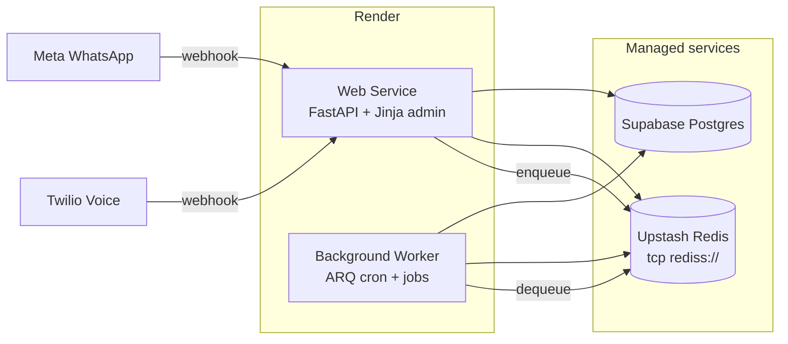

# Launch Runbook — staging / production (Render + Supabase + Upstash)

Операционный чеклист перед первым выкатом RestoMind OS на **staging** или **production**.  
Код ядра P0–P6 (Owner Intelligence sales-ready) готов (**Launch Window**); этот документ — **что настроить снаружи** и как проверить, что всё живо.

**См. также:**

| Документ | Назначение |
|----------|------------|
| [`DEPLOY_RENDER.md`](../DEPLOY_RENDER.md) | Blueprint / ручной деплой Web Service, Dockerfile |
| [`docs/SUPABASE_MIGRATION.md`](SUPABASE_MIGRATION.md) | Postgres URI, `pg_dump` / `pg_restore`, Alembic |
| [`docs/FINAL_MILE_OPS_SIGNOFF.md`](FINAL_MILE_OPS_SIGNOFF.md) | Sign-off iiko Office + Voice Realtime после live smoke |
| [`docs/FINAL_MILE_BROWSER_SMOKE.md`](FINAL_MILE_BROWSER_SMOKE.md) | Ручной browser smoke (RBAC, Final Mile, Shift) |
| [`docs/VOICE_STAGING_CHECKLIST.md`](VOICE_STAGING_CHECKLIST.md) | Twilio Realtime — 3+ звонка |
| [`docs/TELEGRAM_DIGEST_STAGING.md`](TELEGRAM_DIGEST_STAGING.md) | Daily OS Digest в Telegram |
| [`.env.example`](../.env.example) | Полный список переменных |

---

## Архитектура деплоя



**Два процесса на Render обязательны** для prod-like окружения:

1. **Web Service** — HTTP, WebSocket админки, webhook WhatsApp/Voice.
2. **Background Worker** — `python -m arq app.worker.WorkerSettings` (очередь + cron).

Без worker: входящие WhatsApp не обрабатываются, cron (digest, draft recovery, iiko sync) не работает.

---

## 0. Pre-flight (до первого деплоя)

- [ ] Репозиторий подключён к Render (ветка `main`).
- [ ] Supabase project создан, `DATABASE_URL` с `?sslmode=require` скопирован.
- [ ] Upstash Redis создан, скопирован **Redis Connect** URL (`rediss://default:…@….upstash.io:6379`) — **не** REST API.
- [ ] Сгенерированы секреты:
  - `SESSION_SECRET` — `openssl rand -hex 32`
  - `APP_SECRETS_FERNET_KEY` — `python -c "from cryptography.fernet import Fernet; print(Fernet.generate_key().decode())"`
  - `WHATSAPP_VERIFY_TOKEN` — произвольная строка для Meta webhook verify
- [ ] Понятен план: **staging** (`APP_ENV=staging`) или **production** (`APP_ENV=production`).

> **Важно:** Blueprint [`render.yaml`](../render.yaml) уже включает `REDIS_ENABLED=true`, `ARQ_ENABLED=true`, `APP_ENV=production` и worker. В Dashboard **обязательно** задайте **`REDIS_URL`** и **`DATABASE_URL`**. Для dev/sandbox можно временно выставить `REDIS_MEMORY_ONLY=true` (не для prod).

---

## 1. Сервисы Render

### 1.1 Web Service (`restomind`)

| Параметр | Значение |
|----------|----------|
| Runtime | Docker (`Dockerfile` в корне) |
| Region | `frankfurt` (или ближе к Supabase/клиентам) |
| Health check | `GET /health` |
| Pre-deploy | `alembic upgrade head` (уже в `render.yaml`; дублируется в `start.sh` как `alembic upgrade heads`) |
| Start command | из Dockerfile / `start.sh` → `uvicorn app.main:app --host 0.0.0.0 --port $PORT` |

Blueprint: **New → Blueprint** → репозиторий с `render.yaml`.  
Вручную: см. [`DEPLOY_RENDER.md`](../DEPLOY_RENDER.md) вариант B.

### 1.2 Background Worker (`restomind-worker`)

| Параметр | Значение |
|----------|----------|
| Type | **Background Worker** |
| Runtime | тот же Docker-образ, что у web |
| Start command | `python -m arq app.worker.WorkerSettings` |
| Env | **те же секреты**, что у web (минимум: `DATABASE_URL`, `REDIS_*`, `ARQ_*`, `APP_ENV`, AI keys) |

Worker не слушает HTTP; healthcheck Render для него — по логам «worker started».

---

## 2. Матрица переменных окружения

### 2.1 Обязательные (web + worker)

Задайте **одинаково** на обоих сервисах.

| Variable | Пример / формат | Зачем |
|----------|-----------------|-------|
| `APP_ENV` | `staging` или `production` | Включает строгие проверки при старте (ARQ обязателен) |
| `APP_DEBUG` | `false` | Прод-режим; без debug-утечек |
| `DB_MODE` | `postgres` | |
| `DATABASE_URL` | `postgresql://…?sslmode=require` | Supabase Postgres |
| `REDIS_URL` | `rediss://default:PASS@….upstash.io:6379` | Upstash TCP (Pub/Sub админки + ARQ) |
| `REDIS_ENABLED` | `true` | |
| `REDIS_MEMORY_ONLY` | `false` | **`true` отключает внешний Redis** (дефолт blueprint!) |
| `ARQ_ENABLED` | `true` | |
| `ARQ_QUEUE_NAME` | `restomind` | Должен совпадать у web и worker |
| `DB_POOL_SIZE` | `3`–`5` | Пул SQLAlchemy на процесс; `5` допустимо при лимите Supabase session pooler (~15 conn на web+worker) |
| `DB_MAX_OVERFLOW` | `2` | |
| `SESSION_SECRET` | 64+ hex chars | Cookie-сессия + `ws_token` |
| `ADMIN_PASSWORD` | сильный пароль | Не `restomind` |
| `OPENAI_API_KEY` | `sk-…` | Если `AI_PROVIDER=openai` (default) |
| `PUBLIC_BASE_URL` | `https://restomind-xxxx.onrender.com` | Webhooks, Twilio, ссылки в Telegram; на Render можно `fromContext: instance_url` |

### 2.2 Staging — настоятельно рекомендуется

| Variable | Значение | Зачем |
|----------|----------|-------|
| `WHATSAPP_API_TOKEN` | Meta token | Бот |
| `WHATSAPP_PHONE_NUMBER_ID` | ID номера | |
| `WHATSAPP_VERIFY_TOKEN` | ваш verify token | Meta webhook |
| `TELEGRAM_BOT_TOKEN` | | Алерты оператору + Daily OS Digest |
| `TELEGRAM_ADMIN_CHAT_ID` | | |
| `APP_SECRETS_FERNET_KEY` | Fernet key | Шифрование паролей iiko Office в БД |
| `DISPLAY_TIMEZONE` | `Asia/Almaty` | Алерты в локальном времени |

### 2.3 WhatsApp / Meta (Callback URL)

После деплоя в Meta Developer Console:

| Поле | Значение |
|------|----------|
| Callback URL | `{PUBLIC_BASE_URL}/api/whatsapp/webhook` |
| Verify Token | `WHATSAPP_VERIFY_TOKEN` |

### 2.4 Voice AI (опционально, Final Mile)

| Variable | Зачем |
|----------|-------|
| `TWILIO_ACCOUNT_SID`, `TWILIO_AUTH_TOKEN`, `TWILIO_VOICE_NUMBER` | PSTN |
| `OPENAI_REALTIME_MODEL`, `OPENAI_REALTIME_VOICE` | Realtime connector |
| Webhook Twilio | `POST {PUBLIC_BASE_URL}/api/whatsapp/voice/incoming` |

Sign-off: [`docs/VOICE_STAGING_CHECKLIST.md`](VOICE_STAGING_CHECKLIST.md).

### 2.5 Per-org (не env — через админку)

Настраиваются после первого входа в `/admin`:

- iiko Cloud: **Настройки → Подключения** (или superadmin credentials)
- iiko Office (SupplyMind): `GET/PATCH /api/admin/organization/iiko-office`
- Branding, расписание, force-close, payment config — UI настроек

Глобальные fallback в env (`IIKO_API_LOGIN`, `IIKO_ORGANIZATION_ID`) — только для первого онбординга / demo.

### 2.6 Опционально / tuning

| Variable | Default | Примечание |
|----------|---------|------------|
| `AI_MODEL_ROUTING_ENABLED` | `true` | fast→strong routing |
| `BOT_SLOW_ACK_ENABLED` | `true` | typing indicator после 2с |
| `WHATSAPP_FAST_ACK_ENABLED` | `true` | короткие «спасибо» без LLM |
| `PIPELINE_TIMING_ENABLED` | `false` | структурные логи latency (`rm_stage_ms`, incl. `queue_wait`) |
| `SENTRY_DSN` | — | Error tracking |
| `ALLOW_INSECURE_PROD_SETTINGS` | — | **Только аварийно**, потом убрать |

Полный список: [`.env.example`](../.env.example).

---

## 3. Порядок деплоя (пошагово)

### Шаг 1 — Supabase

1. Создать project → скопировать **Database URI** (`sslmode=require`).
2. Локально (опционально): `alembic upgrade head` против Supabase — убедиться, что миграции применяются.
3. Подробно: [`docs/SUPABASE_MIGRATION.md`](SUPABASE_MIGRATION.md).

### Шаг 2 — Render Web

1. Blueprint или ручной Web Service.
2. Заполнить env из §2.1–2.2.
3. Деплой → дождаться **Live**.

Миграции: `preDeployCommand` + `start.sh` выполняют Alembic автоматически.

### Шаг 3 — Render Worker

1. **New → Background Worker** → тот же repo + Docker.
2. Start: `python -m arq app.worker.WorkerSettings`.
3. Скопировать env с web (§2.1 минимум).
4. Деплой → в логах worker: registered cron jobs.

### Шаг 4 — Первый вход

1. `https://<host>/admin` — login (`ADMIN_USERNAME` / `ADMIN_PASSWORD` или staff user из seed).
2. Сменить пароль / создать staff через superadmin при необходимости.
3. **Настройки → Подключения** — WhatsApp, iiko, Telegram.

### Шаг 5 — One-time backfill (графики Phase 5)

После login (cookie-сессия) для каждой org:

```bash
curl -X POST "https://<host>/api/admin/intelligence/backfill-stats?days=30" \
  -H "Cookie: session=<скопировать из браузера после login>"
```

Или через UI / devtools Network. Безопасно: `GREATEST(existing, backfill)` — live event-данные не затираются.

---

## 4. Post-deploy smoke (15 мин)

### 4.1 HTTP / процесс

```bash
# Liveness (Render healthcheck)
curl -sS https://<host>/health
# → {"status":"ok"}

# DB + Redis (ручная диагностика)
curl -sS https://<host>/health/deep
# → status ok, db ok, redis ok
```

### 4.2 Очередь ARQ (после login в админку)

```bash
curl -sS https://<host>/api/admin/system/task-queue-health \
  -H "Cookie: session=..."
```

Ожидание:

```json
{
  "redis": "ok",
  "arq": "ok",
  "worker": "ok"
}
```

Если `worker: down` — worker не запущен или другой `ARQ_QUEUE_NAME`.

### 4.3 Админка (browser)

По [`docs/FINAL_MILE_BROWSER_SMOKE.md`](FINAL_MILE_BROWSER_SMOKE.md):

- [ ] Login → `/admin` без ошибок в Console
- [ ] `GET /api/admin/auth/me` — `available_organizations`, `branding`, `ws_token`
- [ ] WebSocket: новое сообщение в чатах (если есть трафик)
- [ ] Dashboard: revenue leak, shift badge
- [ ] Inbox → «Очередь помощи» загружается

### 4.4 WhatsApp (если подключён)

- [ ] Meta webhook verify (GET challenge)
- [ ] Тестовое входящее сообщение → ответ бота в течение SLA
- [ ] В логах web: `task_queue_enqueue_ok job=whatsapp_process_text`
- [ ] В логах worker: job completed
- [ ] При задержках: в Render Logs grep `queue_wait_ms` и `rm_stage_ms` по `trace_id` (Control Plane в чате → «Цепочка trace»)

### 4.5 Cron (worker logs, первые 24ч)

| Cron | Расписание (UTC) | Задача |
|------|------------------|--------|
| `draft_recovery_scheduled_tick` | каждые ~10 мин | nudge брошенных DRAFT |
| `daily_os_digest_scheduled_tick` | :00/:15/:30/:45 | утренняя сводка (окно 09:00 org TZ) |
| `external_reviews_sync_scheduled_tick` | 02:10, 14:10 | 2GIS отзывы |
| `iiko_inventory_sync_scheduled_tick` | 00:20, 06:20, 12:20, 18:20 | остатки iiko Office |
| `billing_usage_daily_scheduled_tick` | 00:12 | rollup billing |

### 4.6 Ops-скрипты (из корня репо, с prod `DATABASE_URL`)

```bash
# Дубли users.phone (7705… vs +7705…)
python scripts/diag_duplicate_phones.py --org-id 1 --phone +77051310837

# Слияние legacy-дублей (сначала dry-run)
python scripts/merge_duplicate_users.py --org-id 1 --dry-run
python scripts/merge_duplicate_users.py --org-id 1 --apply

# Latency / trace (после медленного сообщения)
python scripts/diag_whatsapp_latency.py --org-id 1 --trace-id <trace_id>
python scripts/diag_whatsapp_latency.py --org-id 1 --phone +77051310837
```

---

## 5. Troubleshooting

| Симптом | Вероятная причина | Действие |
|---------|-------------------|----------|
| Web crash loop при старте | `APP_ENV=production` без Redis/ARQ | `REDIS_URL`, `REDIS_ENABLED=true`, `REDIS_MEMORY_ONLY=false`, `ARQ_ENABLED=true`, worker запущен |
| `SESSION_SECRET обязателен` | Пустой секрет + Postgres | Задать `SESSION_SECRET` или временно `ALLOW_INSECURE_PROD_SETTINGS=true` (**убрать после**) |
| WhatsApp webhook 200, нет ответа | Worker down / ARQ off | §4.2 task-queue-health |
| Ответ 1–2 мин | Web без worker / `DB_POOL_SIZE=1` / очередь LLM | Worker live, pool 3+, grep `queue_wait_ms`, `rm_stage_ms.llm` |
| Дубль номера в «Диалогах» | Два `User` с разным форматом phone | `diag_duplicate_phones.py` → `merge_duplicate_users.py --apply` |
| Admin WS не обновляется | Redis in-memory на web | Upstash + `REDIS_MEMORY_ONLY=false` |
| `health/deep` redis error | Неверный `REDIS_URL` или REST вместо TCP | Upstash **Redis Connect** `rediss://` |
| TLS errors к Redis | CA на Render | временно `REDIS_SSL_SKIP_VERIFY=true` (не для prod long-term) |
| Alembic fail on deploy | Supabase pooler + prepared statements | Direct connection `:5432` или session pooler — см. SUPABASE_MIGRATION |
| Free tier cold start ~60s | Render sleep | Paid plan или external uptime ping |

---

## 6. Sign-off gates (после staging smoke)

Заполнить таблицы в [`docs/FINAL_MILE_OPS_SIGNOFF.md`](FINAL_MILE_OPS_SIGNOFF.md):

| Gate | ROADMAP | Документ |
|------|---------|----------|
| Deploy + migrations + ARQ | §D | этот runbook §3–4 |
| iiko Office live sync | SupplyMind | §A FINAL_MILE_OPS_SIGNOFF |
| Voice Realtime 3+ calls | Voice AI ops | §B + VOICE_STAGING_CHECKLIST |
| Browser RBAC smoke | — | FINAL_MILE_BROWSER_SMOKE |

После sign-off: `[x]` в ROADMAP + запись в `CHANGELOG.md`.

---

## 7. Чеклист «готов к staging» (краткий)

**Инфра**

- [ ] Web Service Live, `/health` → ok
- [ ] Worker Live, task-queue-health → worker ok
- [ ] `alembic current` = head (логи deploy)

**Секреты**

- [ ] `SESSION_SECRET`, `ADMIN_PASSWORD` — не дефолты
- [ ] `REDIS_MEMORY_ONLY=false`, `REDIS_ENABLED=true`
- [ ] `APP_ENV=staging` (или `production`)

**Продукт**

- [ ] Login admin, org выбран
- [ ] WhatsApp webhook verified (если используется)
- [ ] backfill-stats 30d выполнен
- [ ] Browser smoke §4.3 пройден

**Sign-off owner:** _______________ **Дата:** __________ **URL:** _______________

---

## 8. Owner Intelligence OS — deploy smoke (post-migration)

Перед smoke выполните `alembic upgrade head` и убедитесь, что `alembic heads` показывает один head: **`20260604_iiko_last_error_text`**.

### 8.1 Миграции и схема

```bash
alembic upgrade head
alembic heads          # один head
PYTHONPATH=. python scripts/verify_owner_intel_schema.py
python -m compileall -q app
```

Проверяемые объекты БД:

| Объект | Назначение |
|--------|------------|
| `ai_order_audits` + `review_reason` | QA Auto-Audit v2 |
| `upsell_offer_events` | Revenue Copilot attribution |
| `operational_mode_states` | Kitchen Gate v2 |
| `upsell_phrase_variants` | A/B phrase experiments |
| `users.telegram_user_id` | Telegram customer |
| `chat_logs.channel` | WA / Telegram / operator |
| `organizations.pos_provider` | iiko / rkeeper |
| `organizations.telegram_*` | per-org Telegram webhook |
| `menu_items.cost_price` | Menu Profit Lab |

### 8.2 API smoke (авторизованная admin-сессия)

Замените `{BASE}` и cookie/session после логина в `/admin`.

| Endpoint | Ожидание |
|----------|----------|
| `GET {BASE}/api/admin/owner-intelligence/summary?period=7d` | `200`, блоки `kpi`, `upsell_impact` |
| `GET {BASE}/api/admin/owner-intelligence/order-audits?limit=10` | `200`, `items[]` |
| `GET {BASE}/api/admin/owner-intelligence/upsell-impact?period=week` | `200`, `best_pairs`, `worst_offers` |
| `GET {BASE}/api/admin/owner-intelligence/menu-profit?period=7d` | `200`, `promote_today_candidates` |
| `GET {BASE}/api/admin/owner-intelligence/network-benchmark?period=7d` | `200` (или `disabled` для одиночной точки) |
| `GET {BASE}/api/admin/owner-intelligence/kitchen-gate` | `200`, режимы load/delivery |
| `GET {BASE}/api/admin/owner-intelligence/digest/preview?period=prev_week` | `200`, `text`, `metrics`, `last_sent` |
| `POST {BASE}/api/admin/owner-intelligence/digest/send` | `200` или `429` (manual cooldown 30 мин; `{force:true}` обходит) |
| `GET {BASE}/api/admin/owner-intelligence/digest/history` | `200`, события `owner_digest.sent` |

Быстрая проверка импорта приложения:

```bash
python -c "from app.main import app; print('app ok', app.title)"
```

### 8.3 Admin UI smoke (браузер)

- [ ] **AI Center → Owner Intelligence** — KPI, Kitchen Gate, upsell impact, QA audits, digest preview + «Отправить сейчас»
- [ ] **AI Center → Network Benchmark** — только для `is_network`
- [ ] **Settings → Smart Sales** — правила + панель эффекта (pairs, worst offers, promote today)
- [ ] **Menu** — колонка себестоимости, preview CSV import
- [ ] **Shift** — Kitchen Gate presets (+30m / +1h / сброс)
- [ ] **Диалоги** — badge канала WA / TG / Voice
- [ ] Консоль браузера без ошибок на перечисленных экранах

### 8.4 Post-deploy checks

```bash
npm run check:admin-js
python -m pytest -q
```

Ожидаемо: **все тесты зелёные**, `alembic heads` → один head.

### 8.5 Worker / digest

- [ ] Worker live — cron `owner_digest_scheduled_tick` (weekly digest, Monday 10:00–10:44 **local org TZ**)
- [ ] `TELEGRAM_BOT_TOKEN` + org `telegram_ops_chat_id` / `TELEGRAM_ADMIN_CHAT_ID` для digest
- [ ] Admin smoke: **Owner Intelligence → «Отправить отчёт сейчас»** → Telegram получен
- [ ] `GET /api/admin/owner-intelligence/digest/preview` → `200` с `text` и `metrics`
- [ ] `GET /api/admin/owner-intelligence/digest/history` — последняя отправка в `owner_digest.sent` events

**Sign-off OI smoke:** _______________ **Дата:** __________
