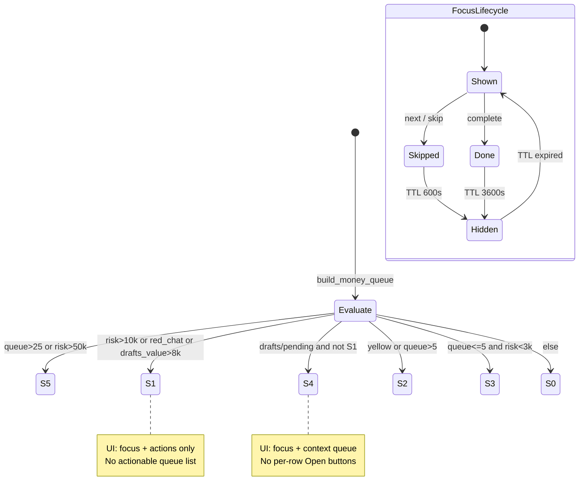

# G10 — Shift Control Plane (операции и прод)

> **Что это:** не dashboard и не новая бизнес-логика. Детерминированная **control plane** поверх G5–G8 (money pipeline): один focus, одно следующее действие, предсказуемое состояние смены S0–S5.

**Код:** [`app/services/shift_state_engine.py`](../app/services/shift_state_engine.py) · **API:** `GET /api/admin/shift/state`, `POST /api/admin/shift/action` · **UI:** [`_tab_shift_control.html`](../app/templates/screens/_tab_shift_control.html)

**Статус v1:** реализовано монолитом в main (см. ROADMAP G10). Ниже — как **безопасно выкатывать по PR**, если разрезать историю, и что **ломает продукт в проде** (failure modes).

---

## 0. Инварианты (жёстко, без двусмысленности)

**Semantic Contract:** [`G10_SEMANTIC_CONTRACT.md`](G10_SEMANTIC_CONTRACT.md) (§1–§11 продукт, §12 concurrency freeze). **Redis-карта:** [`G10_SIMPLIFICATION.md`](G10_SIMPLIFICATION.md).

### Два слоя смысла (§1)

> **`state` = system truth** (реальность смены из G5–G8 `all_items`).
> **`focus` = operational projection** (одно действие после Redis filter + `shift:active_focus` lease).

Они могут расходиться: S1 + `focus=null` → баннер «срочные просмотрены», не «всё спокойно».

### Единственный pipeline данных

```text
G5–G8 (build_money_queue + signals)
        ↓
shift_state_engine (pure: resolve_state, priority_score, select_focus)
        ↓
Redis exclusion (skip / done — только фильтр focus+queue)
        ↓
GET /shift/state → UI (Alpine, без своей сортировки/state)
```

### Запрещено в v1

| Запрещено | Почему |
|-----------|--------|
| UI считает `state` сам | Два источника истины |
| JS сортирует queue / выбирает focus | Дрейф от engine |
| Redis меняет S0–S5 | State только из G5–G8 payload |
| `complete` меняет order/chat в БД | Единственная mutation = event + done key |
| GET `/shift/state` пишет Redis | Read-only (+ scan exclusions) |

### Redis = filter layer

| Может | Не может |
|-------|----------|
| `shift:skip:{org}:{focus_id}` TTL 600s | Менять `state` |
| `shift:done:{org}:{focus_id}` TTL 3600s | Создавать items |
| Исключать id из focus/queue | Влиять на `priority_score` напрямую |

### Actions

| Subtype | Семантика | Побочные эффекты |
|---------|-----------|------------------|
| `next` | Advance pointer (rotation) | Redis `shift:next:*` + `next_set` |
| `skip` | Explicit rejection | Redis `shift:skip:*` + `skip_set` |
| `complete` | Task closed | SETNX `shift:done:*` + event once |

**State** считается из **полного** G5–G8 списка; **focus/queue** — после exclusion.

### UI лимиты (не расширять без ADR)

- `focus` = 1
- `actions` ≤ 3
- `queue` preview ≤ 5
- `state` ∈ {S0…S5}
- S1/S5: queue не как «вторая CRM» (S4 = context-only list)

---

## 1. G10 v1 — PR breakdown (безопасный порядок вливания)

> **Сейчас:** всё уже в main одним срезом. Разбивка нужна для **релиз-инженерии**, hotfix-веток и code review при доработках.

### PR1 — Shift State Engine (pure core)

**Цель:** детерминированность без UI, API, Redis mutations.

**Включает:**

- `shift_state_engine.py`: `ShiftInput`, `resolve_state`, `_is_s1`, `item_priority_score`, `select_focus`, `_split_queue_items`
- `tests/test_shift_state_engine.py` (engine-only: resolve_state, priority, select_focus)

**Не включает:** API, Redis skip/done, UI, `emit_event`.

| Риск | Проверка |
|------|----------|
| Низкий | `pytest tests/test_shift_state_engine.py -q -k "resolve_state or priority"` |

---

### PR2 — Redis exclusion layer

**Цель:** операторская память (skip/done), без изменения state.

**Включает:**

- `_filter_excluded`, `_load_excluded` (`scan_iter`)
- TTL: skip 600s, done 3600s
- Тесты: skip excludes focus; complete idempotent

**Не включает:** изменение `resolve_state` inputs из Redis.

| Риск | Проверка |
|------|----------|
| Средний | «Почему пропал focus?» — только skip/done/TTL, не state |

---

### PR3 — API layer

**Цель:** контракт системы.

**Включает:**

- `GET /api/admin/shift/state`
- `POST /api/admin/shift/action` + `ShiftActionBody`
- RBAC: `_location_scope_for_request`
- Idempotency на `complete`

**Не включает:** удаление legacy `/shift-control`.

| Риск | Проверка |
|------|----------|
| Средний | Контракт JSON, backward compat для badge/старых клиентов |

---

### PR4 — UI Shift Screen (G9 → G10)

**Цель:** операторский интерфейс state-driven.

**Включает:**

- `_tab_shift_control.html` (S0–S5 banners, focus card)
- `admin-app.js`: `shiftState`, `loadShiftState`, `runShiftStateAction`
- Queue rules: S2 actionable, S4 context-only, S1/S5 hidden

| Риск | Проверка |
|------|----------|
| **Высокий** | Smoke: login → вкладка «Смена» → focus → skip/next → refresh 45s |

---

### PR5 — Side effects & observability

**Цель:** система видна в метриках и событиях.

**Включает:**

- `shift.focus_completed` → `BusinessEvent`
- Sidebar/bottom-nav: `shiftState.metrics.risk_kzt`, `at_risk_count`
- CHANGELOG / ROADMAP

| Риск | Проверка |
|------|----------|
| Низкий–средний | Event в логе/инсайтах; badge не null |

---

### PR6 — Legacy cleanup (`/shift-control`)

**Цель:** одна реальность — только `/shift/state`.

**Включает:**

- Deprecate `GET /shift-control` (410 или proxy → state)
- Удалить мёртвый `shiftControl` JS (уже нет в templates)
- Документировать migration для внешних интеграций

| Риск | Проверка |
|------|----------|
| **Высокий, если рано** | Делать **после** PR4 стабилизации в проде ≥1 спринт |

---

### PR7 — Hardening (прод)

**Цель:** предсказуемость под нагрузкой.

**Включает:**

- Focus stability / anti-jitter (см. §3 FM-1)
- S1 hysteresis / EMA risk (FM-2)
- Redis scan optimization (SET per org vs `KEYS`)
- Concurrent skip/complete races
- Load test: 2+ оператора, один org
- Optional: server-side focus lock TTL

| Риск | Проверка |
|------|----------|
| Средний | k6/locust или ручной сценарий 30 мин смены |

---

### Рекомендуемый порядок выката в прод (фазы)

```text
Phase A (shadow):  PR1+2+3 на staging, UI ещё G9 или feature flag
Phase B (UI cut):  PR4+5, операторы на «Смена», мониторинг FM-1..5
Phase C (trust):   PR7 + G10.1 Trust Layer (см. ROADMAP)
Phase D (cleanup): PR6 после 2 недель без инцидентов
```

---

## 2. State machine — formal spec

### 2.1 Resolution order (deterministic)

Проверки **строго в порядке** (первое совпадение):

```text
S5  if queue_size > 25 OR risk_kzt > 50_000
S1  if risk_kzt > 10_000 OR red_chats > 0 OR drafts_value_kzt > 8_000
S4  if (drafts OR pending_payments) AND NOT S1
S2  if yellow_chats > 0 OR queue_size > 5
S3  if queue_size <= 5 AND risk_kzt < 3_000
S0  fallback
```

**Input для state:** полный G5–G8 item list (`all_items`), **до** Redis exclusion.

### 2.2 Priority score (focus selection)

```text
score = (amount_kzt * weight[kind]) + min(wait_minutes, 30) * 50
focus = argmax(score) over active_items (after Redis exclusion)
```

Weights: `high_value_stuck=1.0`, `abandoned_draft=0.8`, `pending_prepay=0.7`, `slow_chat=0.5`.

### 2.3 State transition diagram



### 2.4 Focus lifecycle (operator actions)

```mermaid
sequenceDiagram
    participant Op as Operator
    participant UI as Admin UI
    participant API as POST /shift/action
    participant R as Redis filter
    participant E as shift_state_engine
    participant G as G5-G8

    Op->>UI: Open tab Смена
    UI->>API: GET /shift/state
    API->>G: build_money_queue
    G->>E: resolve_state(all_items)
    E->>R: load skip/done
    R->>E: filter → focus/queue
    E-->>UI: ShiftState

    Op->>UI: Следующее / Пропустить
    UI->>API: subtype next|skip + focus_id
    API->>R: SET shift:skip:{org}:{id}
    API->>E: rebuild state
    E-->>UI: new focus

    Op->>UI: Готово
    UI->>API: subtype complete + focus_id
    API->>R: SET shift:done (idempotent)
    API->>API: emit shift.focus_completed once
    API->>E: rebuild state
    E-->>UI: new focus or empty
```



---

## 3. Failure modes (что реально ломает продукт)

Приоритет: **операторское доверие** > сырой throughput.

### FM-1 — Focus jitter (критично)

| | |
|---|---|
| **Симптом** | Каждый refresh (30–45s) — другой focus; кнопки «не работают» |
| **Причина** | `select_focus()` без стабилизации; мелкие изменения `wait_minutes` / новый chat в queue |
| **Влияние** | Shift = «прыгающий интерфейс тревоги», отказ от вкладки |
| **Fix (G10 + simplify)** | `shift:active_focus:{org}:{operator}` → `focus_id`, heartbeat ~7s, TTL **45s**; busy ids исключаются у коллег. Freeze: [`G10_SIMPLIFICATION.md`](G10_SIMPLIFICATION.md) |
| **Detect** | Лог `focus_id` на каждый GET; alert если >3 смен focus/10 мин без action |

---

### FM-2 — False S1 spikes

| | |
|---|---|
| **Симптом** | Смена «вечно красная» (S1) |
| **Причина** | Любой red chat >5 мин; `risk_kzt` без гистерезиса |
| **Fix** | Hysteresis: enter S1 `risk>10k`, exit `risk<7k`; или EMA по `risk_kzt` за 5 мин |
| **Detect** | % времени в S1 по org; сравнить с реальными confirmed saves |

---

### FM-3 — Silent queue starvation

| | |
|---|---|
| **Симптом** | После серии skip — `focus=null`, пустой экран при ненулевом риске |
| **Причина** | Все items в skip/done; state всё ещё S4/S2 |
| **Fix** | UI: при `focus==null` && `state in (S1,S2,S4)` — banner «Всё просмотрено» + CTA «Следующее» / сброс skip по TTL; опционально server fallback после expired skip |
| **Detect** | Metric `shift_empty_focus_while_risk_positive` |

---

### FM-4 — Redis pollution / scan cost

| | |
|---|---|
| **Симптом** | Медленный GET; focus «навсегда» пропадает |
| **Причина** | `scan_iter` на большом keyspace; TTL не сработал |
| **Fix** | Strict TTL (уже 600/3600); optional nightly cleanup; заменить scan на Redis SET `shift:skip_set:{org}` |
| **Detect** | Latency p95 GET `/shift/state`; count keys `shift:skip:*` per org |

---

### FM-5 — Operator overload (UX)

| | |
|---|---|
| **Симптом** | Shift = вторая CRM; усталость |
| **Причина** | Расширение queue/actions/states |
| **Fix** | Жёсткий cap §0; code review блокирует PR без ADR |
| **Detect** | UX audit: >3 клика до целевого действия |

---

### FM-6 — Concurrent operators

| | |
|---|---|
| **Симптом** | Два оператора complete один focus; дубли event (частично закрыто idempotency) |
| **Причина** | Нет row-level lock на focus |
| **Fix** | Idempotent complete (✅); optional `SETNX` на complete; UI optimistic lock |
| **Detect** | Duplicate `shift.focus_completed` same `focus_id` / hour |

---

### FM-7 — Stale client TTL vs server truth

| | |
|---|---|
| **Симптом** | UI показывает старый focus 30s после skip на другом устройстве |
| **Причина** | `loadShiftState` client TTL 30s |
| **Fix** | После POST action — всегда подставлять response body (✅); WS push optional G10.2 |
| **Detect** | Support tickets «нажал Готово — всё ещё висит» |

---

## 4. Production hardening checklist (Stripe-style)

Использовать перед объявлением G10 **production-ready**.

### Correctness

- [ ] `pytest tests/test_shift_state_engine.py tests/test_shift_control.py tests/test_money_queue.py -q` green
- [ ] State из `all_items`; focus из post-filter
- [ ] `complete` idempotent (повтор не эмитит event)
- [ ] `next` ≡ soft skip (не no-op)
- [ ] GET `/shift/state` не вызывает `setex` / `emit_event`

### Security & tenancy

- [ ] Все запросы scoped `organization_id` + location RBAC
- [ ] `focus_id` не принимает чужой org prefix
- [ ] Rate limit POST `/shift/action` (опционально)

### Performance

- [ ] p95 GET `/shift/state` < 500ms на org с queue ≤ 30
- [ ] Redis scan bounded или заменён на SET
- [ ] Нет N+1 в `build_money_queue` при location filter

### Observability

- [ ] Structured log: `shift_state`, `focus_id`, `queue_size`, `risk_kzt`
- [ ] Counter: `shift.action` by subtype
- [ ] Event `shift.focus_completed` в pipeline analytics
- [ ] Dashboard: FM-1 focus changes / 10 min

### UX / trust

- [x] FM-1 focus lease (`shift:active_focus`, см. G10 Simplification)
- [ ] S1/S5 без actionable queue
- [ ] Empty focus + S4 → не белый экран
- [ ] Sidebar badge = `shiftState.metrics`

### Release

- [ ] Staging smoke 30 мин с реальными DRAFT + red chat
- [ ] Rollback plan: revert UI to G9 tab content (git tag)
- [ ] PR6 legacy removal **не** в первом прод-релизе

---

## 5. Что дальше (без расширения scope)

| Эпик | Содержание | ROADMAP |
|------|------------|---------|
| **G10 Simplification** | lock+queue, single `active_focus`, `heal:mute` — freeze layers | [`G10_SIMPLIFICATION.md`](G10_SIMPLIFICATION.md) |
| **G10.2 Hardening** | S1 hysteresis, failure sim, degraded UI | [`G10_FAILURE_SIMULATION.md`](G10_FAILURE_SIMULATION.md) |
| **G10.3 Legacy removal** | Deprecate `/shift-control` | после 2 недель stable |

**Не делать сейчас:** ML пороги, per-org tuning, time-of-day weights, collapse dashboard, payment closure E2E.

---

## 6. Быстрые ссылки

| Артефакт | Путь |
|----------|------|
| Engine | `app/services/shift_state_engine.py` |
| API | `app/api/admin/analytics.py` |
| Tests | `tests/test_shift_state_engine.py` |
| Legacy G9 | `app/services/shift_control.py`, `GET /shift-control` |
| Money pipeline | `money_queue.py`, `revenue_leak.py`, `draft_recovery.py`, `bot_sla_status.py` |

**Regression one-liner:**

```bash
pytest tests/test_shift_state_engine.py tests/test_shift_control.py tests/test_money_queue.py tests/test_revenue_leak_actions.py tests/test_visibility_money.py -q
```
