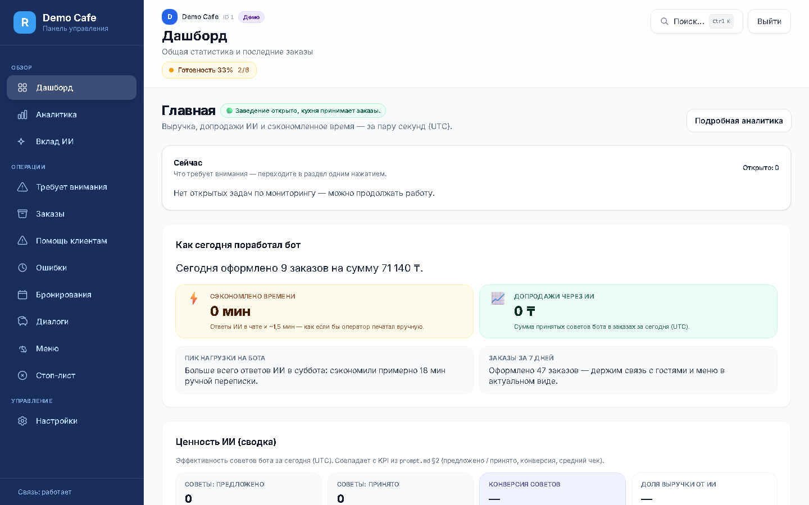
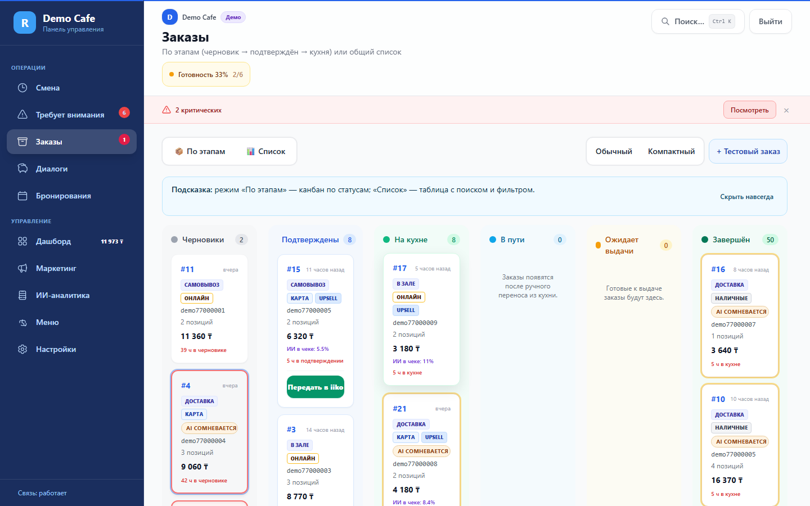
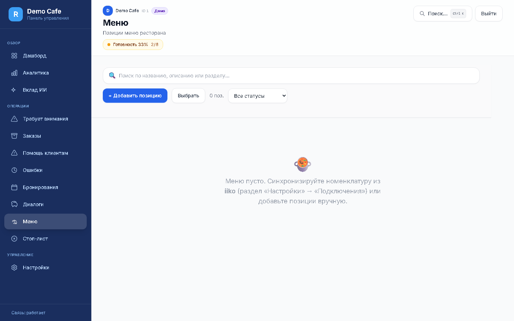
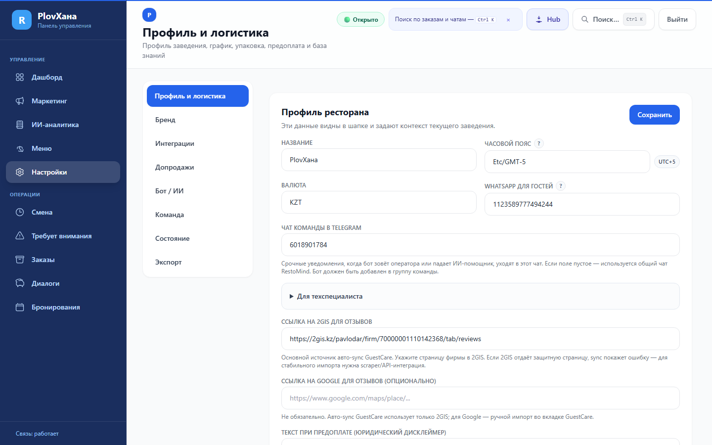
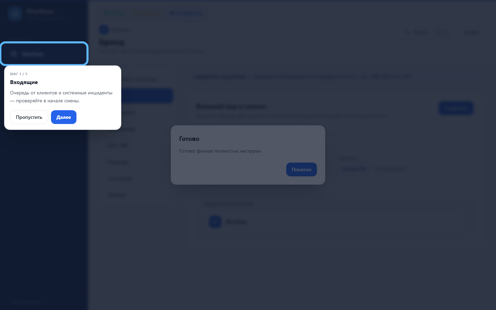
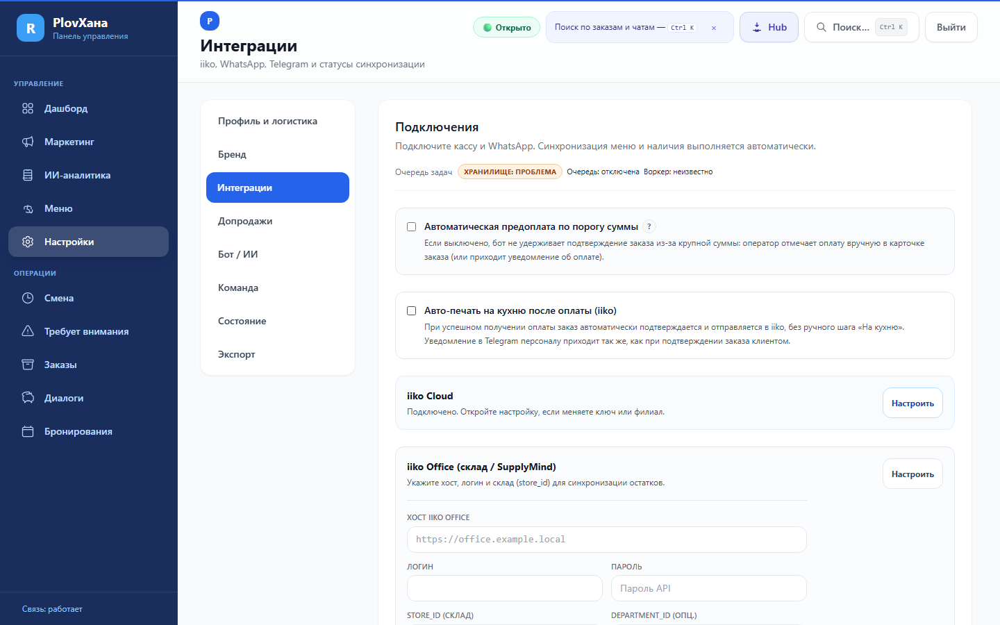
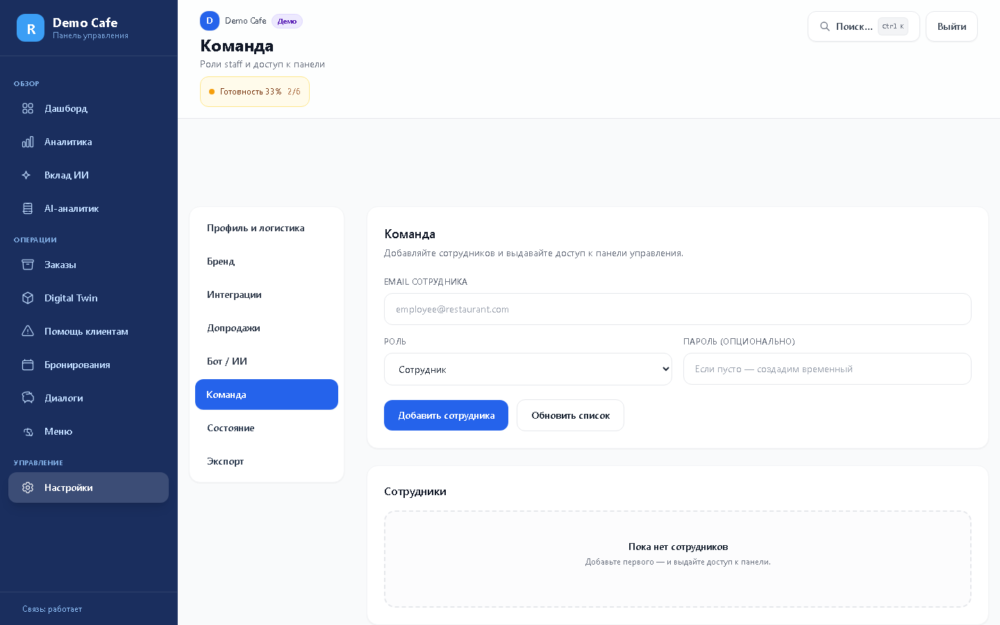
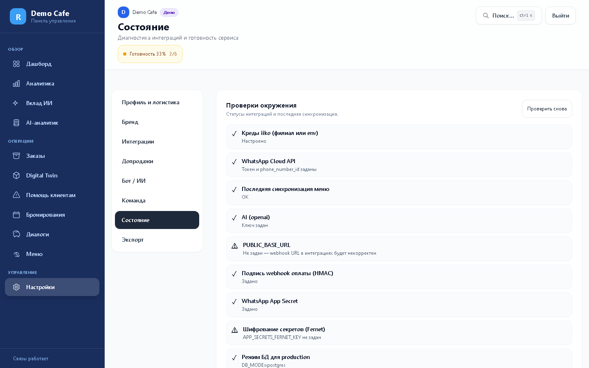
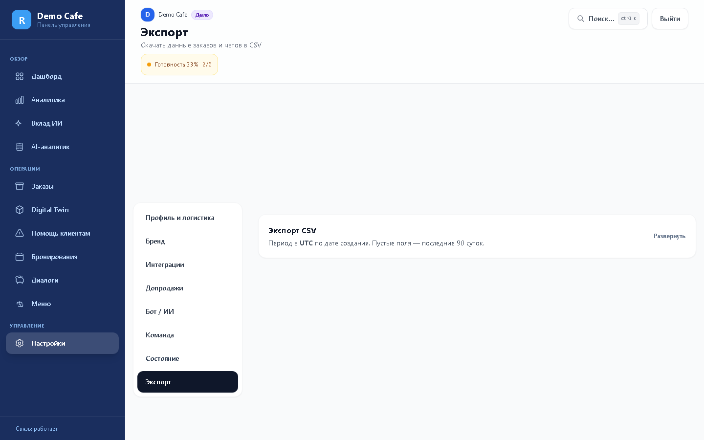
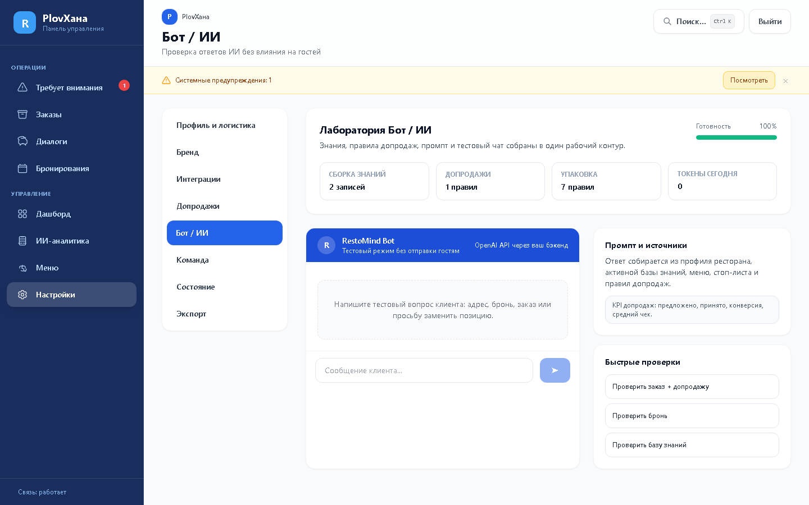

# RestoMind Admin — дизайн-система

Финальная спецификация UI админки (компоненты, токены, IA, a11y, Lighthouse). Стек: **Jinja2**, **Alpine.js**, **Tailwind CSS** (сборка в `app/static/css/admin.css`), **Chart.js**.

---

## Принципы

| Принцип | Смысл |
|--------|--------|
| **Compact density** | Плотная сетка, без лишних полей; KPI и таблицы читаются с первого экрана. |
| **Value-first** | Владелец видит вклад ИИ (ROI, упущенную выручку, спасенные сделки) без долгих переходов. |
| **Mobile-friendly** | На `<sm` модалки ведут себя как **bottom-sheet** (safe-area, крупные таргеты **≥ 44×44 px**). |
| **Role-First IA** | Интерфейс подстраивается под роль staff: оператор не видит лишней аналитики и настроек; владелец получает полную картину. Mode Bar в UI **убран** (G10.4+). |
| **Dark-ready** | Токены в `:root` как CSS-переменные; тёмная тема не реализована, но имена и структура под неё допускают расширение. |

---

## CSS-переменные (`:root`)

Задаются в [`src/css/admin-input.css`](../src/css/admin-input.css) и попадают в собранный [`app/static/css/admin.css`](../app/static/css/admin.css).

| Переменная | Назначение |
|------------|------------|
| `--color-text` | Основной текст (`#0f172a`). |
| `--color-text-muted` | Вторичный текст (`#64748b`). |
| `--color-surface` | Фон карточек/панелей (`#ffffff`). |
| `--color-surface-muted` | Приглушённый фон (`#f8fafc`). |
| `--color-border` | Границы и разделители (`#e5e7eb`). |
| `--space-2`, `--space-3`, `--space-4` | Базовые отступы (0.5 / 0.75 / 1 rem). |
| `--radius-lg`, `--radius-xl` | Радиусы (0.75 / 1 rem). |

Палитра бренда для акцентов в интерфейсе наследуется из **`Organization.brand_color_hex`** через JS ([`app/static/js/admin-brand-tokens.js`](../app/static/js/admin-brand-tokens.js), подключение в админке): производные HSL подставляются в работу чата/превью; утилитарные классы Tailwind `brand-*` в **новых** блоках избегаем — предпочтительны токены и классы `ds-*`.

**Z-index:** модальные слои используют классы `.ds-modal-backdrop` (50) / `.ds-modal-panel` (51), drawer — 60/61, тосты — 70 (см. собранный CSS).

---

## Каталог компонентов (Jinja)

Источник макросов: [`app/templates/components/`](../app/templates/components/). Живая витрина: **`GET /admin/_/components`** (доступ superadmin или `APP_DEBUG=true`) — [`_components_storybook.html`](../app/templates/_components_storybook.html).

Ниже — имена файлов и типичный вызов. Полные сигнатуры смотрите в начале каждого файла.

| Файл | Назначение |
|------|------------|
| `_button.html` | `btn(...)` — варианты primary / secondary / ghost / danger / success, размеры sm / md / lg. |
| `_card.html` | `card(...)` — обёртка секции через `caller()`. |
| `_modal.html` | `modal(id, title, size, ...)` — `role="dialog"` `aria-modal="true"`, связка `aria-labelledby` с заголовком. На `<640px` панель крепится к низу экрана (bottom-sheet). |
| `_drawer.html` | `drawer(id, title, ...)` — нижняя штора; заголовок — `<h2 id="{{ id }}-title">` для `aria-labelledby`. |
| `_tabs.html` | Вкладки с вариантами underline / pills / sidebar. |
| `_section_header.html` | Заголовок секции + действия. |
| `_kpi_card.html` | KPI-плитки (`ds-kpi`). |
| `_table.html` | Таблица с обёрткой `ds-table-wrap`. |
| `_badge.html`, `_status_badge.html` | Бейджи и статусы заказов/броней. |
| `_input.html`, `_select.html`, `_textarea.html`, `_toggle.html` | Поля форм в стиле `ds-*`. |
| `_color_picker.html`, `_file_dropzone.html` | Специализированные контролы. |
| `_empty_state.html`, `_skeleton.html` | Пустые состояния и загрузка. |
| `_segmented.html` | «Пилюли» переключения (`ds-segmented`), минимальная высота кнопок **44px**. |
| `_app_shell.html` | Каркас чата / трёхпанельный layout. |
| `_settings_tabs.html` | Навигация по группам настроек. |

**Наследие совместимости:** `ui_card`, `order_card_*`, `order_status_badge` — см. `_ui_card.html`, `_order_card.html`.

### Скриншоты (baseline) и витрина компонентов

Live macros: **`GET /admin/_/components`** (superadmin or `APP_DEBUG=true`). Baseline screenshots are generated locally with [`scripts/capture_admin_u0_baseline.py`](../scripts/capture_admin_u0_baseline.py); PNG artifacts are ignored so they do not drift in git.

Дополнительно: **mobile review** со скриншотами из Playwright и приоритезированным списком улучшений — [`docs/ui/mobile-review/README.md`](ui/mobile-review/README.md).

| Дашборд | Заказы | Меню |
|--------|--------|------|
|  |  |  |

| Настройки: ресторан | Бренд | Интеграции |
|---------------------|-------|------------|
|  |  |  |

| Команда | Здоровье | Техническое | Бот / ИИ |
|---------|----------|-------------|----------|
|  |  |  |  |

Дополнительно в baseline: аналитика, чаты, брони, стоп-лист, «Вклад ИИ», очередь оператора и др. — см. [README в baseline](ui/baseline/README.md).

---

## Информационная архитектура (IA)

Старая → новая структура (меню сайдбара): это фиксируется в текущем UI (см. `admin.html`/`admin-app.js`), а “что делать дальше” — в `docs/ROADMAP.md`.

| Было | Стало (до P1.5.0) | После P1.5.0 |
|------|-------------------|--------------|
| Дашборд, Аналитика, AI-аналитик, Вклад ИИ, Digital Twin в разных пунктах / deep-link | Дашборд + Аналитика + ИИ-разделы отдельно; «Вклад ИИ» часто в сайдбаре через `ensureAi2NavItems` | **Управление:** Дашборд (под-табы **Главная / Аналитика**), **ИИ-аналитика** (под-табы **Вклад ИИ / Инсайты / Нагрузка**), Меню, Настройки |
| Меню + Стоп-лист | Один раздел «Меню», табы `catalog` / `stoplist` | без изменений |
| «Помощь клиентам» + deep-link `incidents` + legacy `errors` | failed_tasks в одном экране; инциденты отдельно по ссылке | **Операции:** **Требует внимания** (под-табы **От клиентов** / **Системные**), хеши `#operator_queue` / `#incidents` / `#errors` редиректят на `#inbox?tab=…` |
| Заказы: разрозненные режимы | Канбан / таблица | без изменений |

**Deep-links:** маппинг старых hash → новые в [`adminParseLocationHash` / `navigateToTab`](../app/static/js/admin-app.js) (см. P1.5.0 в `docs/ROADMAP.md`).

---

## Anti-patterns

Не добавлять в новых блоках:

- «Сырые» карточки вида `rounded-2xl bg-white shadow-sm` без макроса `_card` / классов `ds-card`.
- Произвольный `z-index` на модалках — только стек `ds-modal-*` / `ds-drawer-*`.
- Inline full-screen оверлеи вместо `_modal.html` / согласованного паттерна `ds-modal-backdrop` + `ds-modal-panel`.
- Иконки-кнопки без `aria-label` / без `aria-hidden` на декоративном SVG.
- «Marketing‑эстетика» (glassmorphism, градиенты, крупные пустые карточки) в operations‑зонах. RestoMind — не лендинг, а пульт оператора.
- **HTMX / Turbo / «частичный HTML»** ради «мгновенного» переключения табов. Админка — **Jinja2 + Alpine.js**: верхний уровень — один `admin.html`, навигация через `currentTab` **без full page reload**; WebSocket остаётся на том же жизненном цикле страницы. Для performance — `x-if` / mount-on-demand (см. `docs/ROADMAP.md` lazy DOM), а не отдельный стек.

---

## Time & timezone

- **Живые ленты** (заказы, чаты, инциденты, «Сейчас» на дашборде) — в списке предпочтительны **относительные** метки (`fmt.timeAgo` / «3 мин назад») с **абсолютной** датой/временем в `title` / tooltip.
- **Агрегаты и Z‑отчёты** (аналитика, графики, сравнение с «вчера») — явно указывать **таймзону контекста** (например, «период в UTC, как на дашборде») или **таймзону филиала** рядом с заголовком, если метрика привязана к локальному дню.
- **Числа в таблицах** — `tabular-nums`, денежные и количественные столбцы выравнивать по правому краю там, где это не ломает читаемость первого столбца.

---

## Density modes

Operations‑интерфейс должен работать в двух режимах плотности — по умолчанию **Normal** (читабельно для владельца), переключаемо в **Compact** (для оператора в час пик). Выбор хранится в `localStorage` пер‑пользователю (ключ `restomind_density:<scope>`), поэтому персональные настройки не теряются между релизами.

| Scope | Normal (default) | Compact |
|-------|------------------|---------|
| **Канбан заказов** | Карточка с двумя строками текста, тегами способа доставки/оплаты, кнопкой действия. Высота ~`104px`. | Одна строка: номер, сумма, телефон last4, статус‑точка. Иконки вместо тегов (🚗/🛵 — тип доставки, 💳/💵 — оплата). Высота `≤ 56px`. Цель — **≥ 8 карточек в колонке** на 1440px без скролла. |
| **Таблица заказов** | `py-3`, разделители, `text-sm`. | `py-1.5`, `text-xs`, `tabular-nums`, `font-medium` только для суммы и номера. |
| **Список чатов** | Аватар + имя + последний фрагмент в 2 строки. | Имя + бейдж непрочитанных + время; preview скрыт. |

Правила:

- В новом блоке всегда сначала верстать Normal, затем добавлять модификатор `…--compact` через CSS‑токены, без дублирования разметки.
- Compact‑режим **не** уменьшает touch target ниже 44×44 px на мобильном — на `<sm` Compact игнорируется и используется Normal.
- Кнопки **закрытия** модалок / drawer и **destructive** действия на touch (`pointer: coarse` или известный tablet/iPad breakpoint): предпочтительно **≥ 48×48 px** (`min-h-[48px] min-w-[48px]`); основная primary‑кнопка в потоке формы остаётся на правиле **44 px** минимума.
- Цвета и иконки в Compact обязаны нести семантику: статус‑точки следуют [`_status_badge.html`](../app/templates/components/_status_badge.html), иконки — из текущего набора Heroicons outline.
- Empty state в operations‑зонах (Inbox Zero, «Нет инцидентов») верстать как однострочный баннер высотой `≤ 64px`, не как полноэкранный плакат.

---

## AI in UI

ИИ — отдельный «голос» в интерфейсе. Чтобы оператор за 0.1 сек различал бот/человек/систему, и чтобы владелец доверял автоматике, действуют единые правила:

- **Цвет AI‑контента** — мягкий фиолетовый/индиго акцент (`--color-ai`, по умолчанию `#7c3aed` 8 % фон и 100 % бордер‑точка). Используется в:
  - бабле AI‑сообщения в чате (`ds-chat-bubble--ai`),
  - бейдже инсайта продаж (`salesInsightSourceLabel === 'ИИ'`),
  - индикаторе «AI снят с диалога».
- **Источник всегда подписан**: `ИИ` / `Правило` / `Оператор` — короткая подпись слева от времени. Не использовать только цвет — это ломает доступность и ч/б скриншоты.
- **AI Confidence**:
  - `low_confidence` (fuzzy match по позиции/адресу < 0.8 или непрошедшая верификация) — жёлтый бордер карточки + бейдж `AI сомневается, проверьте`;
  - `model_refusal` / `transient_error` — нейтральный серый, без алярма (это техника, не вина гостя);
  - `escalated` — красный, с CTA «Посмотреть диалог».
- **Explainability‑pill**: рядом с AI‑бейджем в заказе/чате — маленький `i` (`role="button"`, `aria-label="Почему ИИ так решил"`); по клику — popover с `recommendation_trace` (источник, причина, gastro‑hint, strategy_logic). Это уже частично реализовано (`salesInsightAiReason`, `salesInsightGastroHint`, `salesInsightStrategyLogic` в [`admin-app.js`](../app/static/js/admin-app.js)) — нужно вынести в общий компонент.
- **AI Snooze**: «отключить ИИ» — всегда с временным окном (`30 мин / 2 ч / до завтра / навсегда`). После окончания — индикатор «ИИ снова в диалоге» в шапке чата. Никаких «бесшумных» постоянных отключений — это компромисс продукта (ИИ должен возвращаться сам).
- **Realtime feel**: для AI‑событий (новый ответ ИИ, эскалация, переход в `human_mode`) — пульс‑индикатор `1.5s` в табе и в нав‑бейдже сайдбара, чтобы сигнал был заметен в боковом зрении. Для обычных REST‑обновлений пульс не используем — иначе нивелируется.
- **Лента чата:** служебные ответы в `human_mode` не показывать сырым `[OPERATOR_ONLY …]` — `formatChatDisplayContent` → «ИИ не отвечает (ожидает оператора)». Сбой LLM (fallback) — бейдж «Сбой ИИ» (`meta.technical_fallback`), не путать с ручным takeover. Шапка FSM должна совпадать с `state_changed` / `onHumanNeeded` (см. `docs/STATE_MACHINE.md`).

---

## Role-First Admin IA (G10.4+) — Sprint 5 pivot

> **Контекст:** после Sprint 1–4 (Mode Engine, Shift split, Inbox Action Queue, Command Bar) выяснилось, что **трёхрежимная Mode Bar** добавляет клики без ценности. UI перешёл на **навигацию по роли staff**; internal `currentMode` (`shift|control|intelligence`) остаётся для hash sync и Command Bar, но пользователь режимы не переключает.

### Execution OS — три закона (без изменений)

1. **LAW 1 — Single Focus Principle** — один `shiftState.focus`; см. [`G10_SEMANTIC_CONTRACT.md`](G10_SEMANTIC_CONTRACT.md) §5.
2. **LAW 2 — Sequential Mobile Cognition** — Staged Focus Navigation на `<lg`.
3. **LAW 3 — Locality of Operations** — фильтр по `location_id` в шапке.

### Роли и сайдбар

| Роль | Allowed tabs | Landing (без hash) |
|------|--------------|-------------------|
| **operator** | `shift`, `inbox`, `orders`, `chats`, `bookings` | `shift` если `risk_kzt > 0` или `focus.id`, иначе `inbox` |
| **manager** | операции + `menu`, `dashboard`, `ai_center` | `dashboard` |
| **admin** | все `navItems` | `dashboard` |

Фильтр: `isTabVisibleForRole()` в [`_sidebar.html`](../app/templates/screens/_sidebar.html) и [`_bottom_nav.html`](../app/templates/screens/_bottom_nav.html) (mobile).

### Дашборд: Обычный / Расширенный

- `analyticsDensity`: `normal` \| `advanced` (persist `localStorage.restomind_analytics_density`). UI: переключатель **«Обзор» / «Подробная аналитика»** (одна точка входа, без дублирующей кнопки).
- **normal** (Обзор) — KPI за день, упущенный доход, ROI бота, live feed ОС, тепловой пик продаж (без тяжёлых графиков).
- **advanced** (Подробно) — `_tab_analytics.html`: часы продаж, воронка, heatmap, **«Официанты»** (KPI из iiko ETL), menu engineering, география.
- Toggle виден только `manager` / `admin` (`canToggleAnalyticsDensity()`); persist `localStorage.restomind_analytics_density`.

### Shift calm-empty

При S0/S3 без focus и без риска — компактный CTA «Перейти в очередь» / «Открыть диалоги» вместо четырёх нулевых KPI (`shiftIsCalmEmpty()`).

### Execution Kernel UI (Shell v2 / G10.5)

> **Role-first без Mode Bar.** Оператор живёт на вкладке **Смена**; inbox — вторичный «полный список рисков».

- **Focus Card** — единый макрос [`_focus_card.html`](../app/templates/components/_focus_card.html); mapper `focusCardFromShiftState()` в `admin-app.js`.
- **Контракт полей и semantics** — [`docs/FOCUS_CARD_SPEC.md`](FOCUS_CARD_SPEC.md).
- **Operator routing:** карточки inbox для `operator` → `openMoneyQueueItemViaShift` (shift context, не дублировать chat dock).
- **Sidebar:** `shift` — `ds-nav-item--execution-primary`; inbox label «Все риски» для operator.

**Сохранено из Sprint 1–4:** Shift Focus Deck, staged nav, Inbox Action Queue, Command Bar Ctrl+K, `ds-status-*`.

---

## Focus-Driven OS (legacy internal) — Sprint 1–4

> Mode Bar **убран из UI** (Sprint 5). Ниже — internal matrix для `adminModeEngine` / Command Bar.

| Internal mode | Tabs |
|---------------|------|
| shift | `shift` |
| control | `inbox`, `orders`, `chats`, `bookings`, `menu` |
| intelligence | `dashboard`, `ai_center`, `settings`, `marketing` |

### Universal Semantics (единая палитра статусов)

Для списков, pulse, бейджей и focus-карточек — **один контракт** (Sprint 1: CSS-токены в `src/css/admin-input.css`):

| Семантика | Класс / токен | Когда |
|-----------|---------------|--------|
| 🟢 OK | `ds-status-ok` | Задача закрыта, pulse green, ИИ в авто-режиме |
| 🟡 Warn | `ds-status-warn` | Нужна реакция, pulse amber, AI confidence low |
| 🔴 Danger | `ds-status-danger` | Риск денег: pulse red, отмена, сбой оплаты |
| 🟣 AI | `ds-status-ai` | ИИ на паузе, AI-bubble, snooze, intent panel |
| ⚫ Inactive | `ds-status-inactive` | Архив, human_mode, неактивная точка |

**Существующие аналоги (не дублировать):** Live Pulse G5 в чатах (`chatPulseStatus`), `--color-ai` в § AI in UI, `ds-badge-warning-soft` для confidence. Новые `ds-status-*` — **унификация**, постепенная замена ad-hoc Tailwind в operations-зонах.

### Shift Mode — layout

**Desktop (`≥lg`):** split — **Left Panel** (Focus Deck: focus + queue preview ≤5) + **Right Panel** (Context Dock по `focus.kind`).

**Mobile (`<lg`):** Staged Focus Navigation (LAW 2).

**Пустой focus при ненулевом риске:** гибрид — TTL `skip` 600s **и** вторичная CTA **`reset_skips`** при `shift_empty_focus_while_risk_positive` (✅ FM-3). Не делать `reset_skips` primary CTA на каждом экране.

### Focus Card ↔ `GET /shift/state`

UI рендерит поля **`focus`** как отдано API ([`_focus_payload`](../app/services/shift_state_engine.py)): `id`, `kind`, `type`, `title`, `subtitle`, `value_kzt`, `wait_minutes`, `pulse`, `phone`, `order_id`, `actions`, `reason`. Не вводить параллельные имена (`risk_kzt`, `color_code`, `entity.*`) на фронте без ADR.

**Context Dock (Sprint 2):**

| `focus.kind` | Шаблон |
|--------------|--------|
| `slow_chat` (pulse red/amber) | `_shift_focus_chat.html` — чат + Order Card + AI Intent |
| `abandoned_draft`, `pending_prepay` | `_shift_focus_order.html` — состав корзины + recovery CTA |

### Voice call log (locality)

- При выбранной точке: `GET /voice/calls?location_id={selectedLocationId}&limit=…` (✅ API + RBAC).
- Без точки / Intelligence summary: org-wide список допустим.
- `location_id` в `payload_json` при `record_voice_call` ✅ — фильтр `?location_id=` end-to-end (Final Mile strip + Twilio routing).

---

## Миграция: новая страница / блок

1. Проверить [`app/templates/components/`](../app/templates/components/) — есть ли готовый макрос.  
2. Если нет — расширить макрос (параметры, слот `caller()`), а не копировать разметку.  
3. Стили только через **`ds-*`** и CSS-переменные из `:root`; новые цвета бренда — через токены, не через `bg-brand-600` в новых секциях ([restomind-zones](mdc:.cursor/rules/restomind-zones.mdc) / [ui-redesign](mdc:.cursor/rules/ui-redesign.mdc)).  
4. Модалка на мобильном автоматически получает нижнюю панель и отступ `safe-area`; при отдельном сценарии — `_drawer.html`.  
5. Клавиатура: глобальный **Escape** закрывает верхний слой оверлея ([`handleGlobalKeydown`](../app/static/js/admin-app.js)); для канбана — **стрелки** между колонками с `[data-kanban-col]`.  
6. После правок: `npm run build:admin-css` если меняли [`src/css/admin-input.css`](../src/css/admin-input.css); `pytest`; смоук в браузере.

---

## Доступность и мобильная приёмка

- **Touch:** цели ≥ **44×44 px** — классы `ds-segmented`, `ds-btn-*`, массовое `min-h-[44px]` для компактных кнопок в [`admin.html`](../app/templates/admin.html).  
- **Модалки:** `role="dialog"` `aria-modal="true"`; нижняя «ручка» и `padding-bottom: max(1rem, env(safe-area-inset-bottom))` на узком экране.  
- **Lighthouse (mobile), авторизованная сессия:** скрипт [`scripts/run_admin_lighthouse.mjs`](../scripts/run_admin_lighthouse.mjs) + `npm run lh:admin` (нужен запущенный `uvicorn`). Сохраняет **`docs/ui/lighthouse/summary.json`**, таблицу в **`docs/ui/lighthouse/README.md`** и полные отчёты в `docs/ui/lighthouse/reports/` (каталог в `.gitignore`). Целевые пороги: **Accessibility ≥ 90**, **Performance ≥ 80**, **Best practices ≥ 90** на дашборде, заказах, меню и настройках (в скрипт включены все 8 подвкладок настроек).  
- Первый запуск Playwright: `npx playwright install chromium`.

---

## Связанные документы

- `docs/ROADMAP.md` — единственный трекер задач/техдолга; блок **Focus-Driven OS (Admin Shell)** в P5.  
- `docs/OS_TRANSITION_PLAN.md` — § UI Layer (Phase 6), Strangler-выкатка.  
- `docs/G10_SHIFT_CONTROL_PLANE.md`, `docs/G10_SEMANTIC_CONTRACT.md` — backend смены и focus contract.  
- `docs/ui/baseline/` - local output folder for visual-regression screenshots; PNG files are generated and ignored.  
- `docs/ui/lighthouse/` — отчёты Lighthouse и таблица сводки.  
