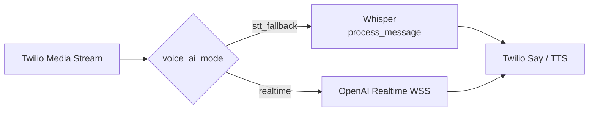

# Voice AI Pilot

## Goal

Accept restaurant calls through Twilio Media Streams and reuse the RestoMind AI pipeline: context read, decision engine, snapshot, audit, and customer response — with optional **OpenAI Realtime** duplex audio.

## Architecture

### Shared ingress

1. Incoming call: `POST /api/whatsapp/voice/incoming` → TwiML `<Connect><Stream>`.
2. Audio stream: `WS /api/whatsapp/voice/stream` — Twilio μ-law 8 kHz.
3. **Org resolution:** `To` E.164 → `resolve_org_from_twilio_number()` ([`twilio_routing.py`](app/services/twilio_routing.py)): `Organization.meta_json.twilio_voice_number`, else settings fallback.
4. Feature flag: `Organization.meta_json.voice_ai_enabled` (default `false`).
5. Audit: [`voice_call_logs`](app/db/models.py) + `record_voice_call(..., mode=...)`.

### Mode: `stt_fallback` (production today)

- Buffer μ-law → WAV → [`transcribe_voice`](app/services/ai_brain.py) (Whisper) → [`process_message`](app/api/webhooks.py) → Twilio Say via existing telephony helpers.
- Implemented in [`webhooks.py`](app/api/webhooks.py) (`twilio_voice_stream` buffer loop).

### Mode: `realtime` (implemented; staging pending)

- `Organization.meta_json.voice_ai_mode = realtime`.
- Bidirectional bridge: Twilio μ-law 8 kHz ↔ OpenAI Realtime WSS (PCM16) via [`app/services/voice_realtime/`](app/services/voice_realtime/):
  - `session.py` — Realtime session lifecycle
  - `twilio_bridge.py` — `run_realtime_voice_bridge(websocket, org_id, call_sid, phone)`
  - `tools.py` — tools: `lookup_menu` (org-scoped menu DB), `escalate_to_whatsapp` (WhatsApp send + accounting)
- `webhooks.py` branches: `get_voice_mode(org) == "realtime"` → bridge; else `_run_stt_fallback_voice_stream()`.
- **Graceful degradation:** Realtime connect/handler error → log + TwiML `<Say>` + `<Hangup>`; STT path unchanged.
- **Product gate:** `stt_fallback` remains the default production mode for mass-market restaurants. `realtime` is premium/experimental until the staging call includes cost per minute and latency numbers.

## Guardrails

- Per-org: `voice_ai_enabled`, `voice_ai_mode` (`stt_fallback` | `realtime`).
- Admin: `GET /api/admin/intelligence/voice/status` (`realtime_ready` when API key + mode=realtime).
- Admin: `POST /api/admin/intelligence/voice/config` — `{ enabled, mode }`.
- LLM/STT/Realtime runs **outside** request DB transaction (read → close → AI → write).

## Environment (Realtime)

| Variable | Purpose |
|----------|---------|
| `OPENAI_API_KEY` | Required for Realtime |
| `OPENAI_REALTIME_MODEL` | e.g. `gpt-4o-realtime-preview` (optional, has default in config) |
| `OPENAI_REALTIME_VOICE` | e.g. `alloy` (optional) |
| `VOICE_REALTIME_MAX_SESSION_SEC` | Session cap (optional) |
| `PUBLIC_BASE_URL` | HTTPS WSS URL for Twilio `<Stream>` |
| `TWILIO_AUTH_TOKEN` | Signature verification |

Per org: set `meta_json.twilio_voice_number` to the Twilio number that receives calls (E.164).

## Implemented MVP

- Twilio incoming + Media Streams websocket (STT path).
- Per-org enable/disable + mode flag in `meta_json`.
- `GET/POST` voice status/config.
- `voice_call_logs` lifecycle + transcript append.

## Remaining (production gate)

- [ ] Staging phone test: real Twilio bidirectional stream + `mode=realtime` — см. [`docs/VOICE_STAGING_CHECKLIST.md`](docs/VOICE_STAGING_CHECKLIST.md).
- [x] `tests/test_voice_realtime.py` + `tests/test_twilio_routing.py` + `tests/test_voice_staging.py`.
- [x] Full `lookup_menu` (menu DB scoped by org) + `escalate_to_whatsapp` (WhatsApp send).
- [ ] Latency and cost report per minute/call (fill after staging).
- [ ] LiveKit or carrier TTS — backlog only if Realtime insufficient.

## Enable Realtime (after deploy)

1. `POST /api/admin/intelligence/voice/config` with `{ "enabled": true, "mode": "realtime" }`.
2. Set org `twilio_voice_number` to match Twilio «To» number.
3. Confirm `GET /voice/status` → `realtime_ready: true`.
4. Place test call; verify `voice_call_logs.mode = realtime`.

Limitations v1: single concurrent bridge per call; tools are stubs; no call transfer to human operator line.
